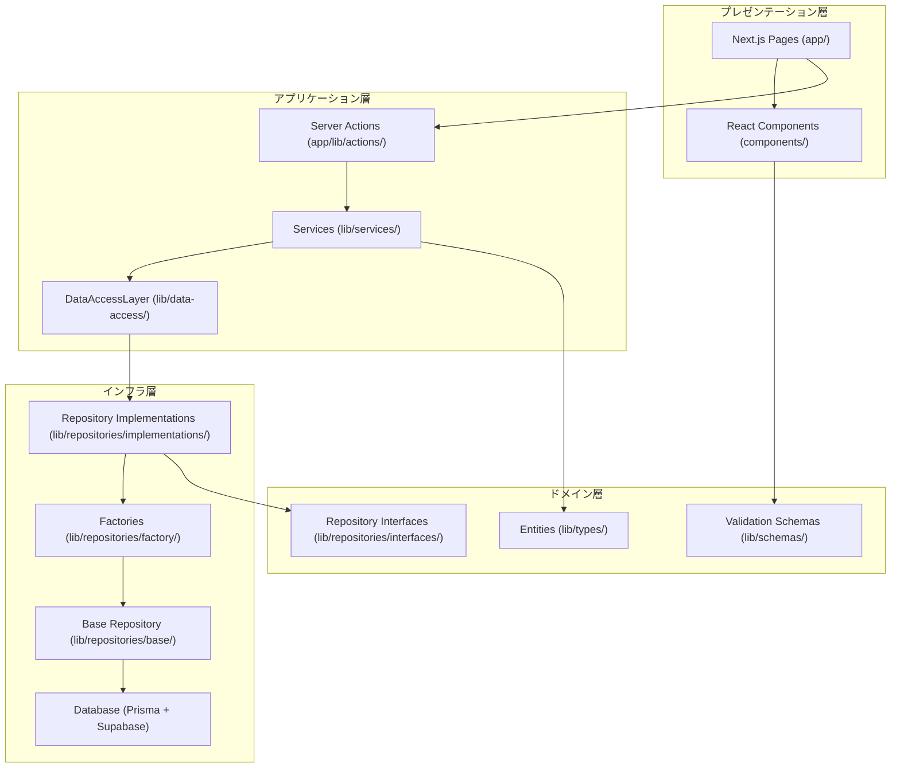
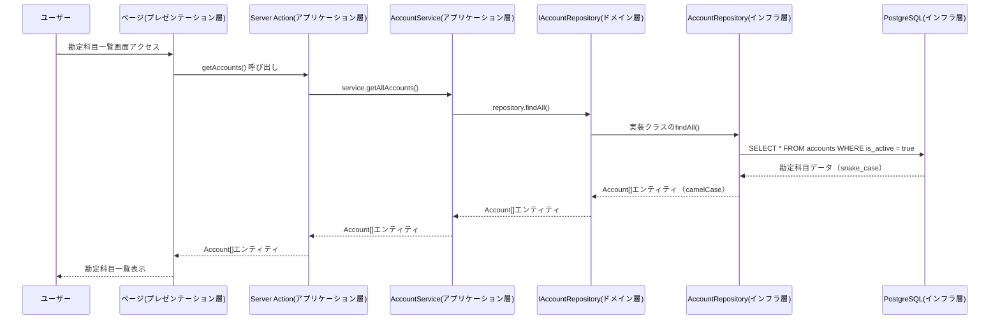

# アーキテクチャ設計

## なぜ 4 層アーキテクチャなのか？

### アーキテクチャ選択の背景

会計システムには複雑な要求があります：

- **複式簿記のルール**: 借方と貸方の合計が必ず一致する必要がある
- **税務処理**: 消費税計算、源泉税計算など法律に基づく計算
- **監査対応**: いつ、誰が、何を変更したかの記録が必要
- **長期保管**: 会計データは 7 年間保管する法的義務がある

これらの複雑さを整理するために、**責務を 4 つの層に分離**します。

### 4 層に分ける理由

#### 1 層だけの場合の問題

```typescript
// すべてが混在した悪い例
function createAccount() {
  // 画面表示、ビジネスロジック、データベース処理が混在
  const form = document.getElementById("form"); // 画面
  const code = form.value; // 入力
  if (code.length < 3) throw new Error("無効"); // ビジネスルール
  await db.query("INSERT..."); // データベース
  alert("成功"); // 画面
}
```

#### 4 層に分けた場合の利点

```typescript
// 責務が明確に分離された良い例

// プレゼンテーション層: 画面表示のみ
function AccountForm() {
  return <form onSubmit={handleSubmit}>...</form>;
}

// アプリケーション層: 処理の流れのみ
async function createAccount(data) {
  return await accountService.create(data);
}

// ドメイン層: ビジネスルールのみ
class AccountService {
  validate(code) {
    if (code.length < 3) throw new Error("無効");
  }
}

// インフラ層: データベース操作のみ
class AccountRepository {
  async save(account) {
    return await db.account.create(account);
  }
}
```

## 全体アーキテクチャ

Biz Clone は、**レイヤードアーキテクチャ**を採用しており、各層の責務を明確に分離しています。



## 各層の詳細な責務と実装

### 1. プレゼンテーション層 - 「ユーザーとの接点」

**場所**: `app/`, `components/`  
**役割**: ユーザーが見る画面と操作を担当

#### なぜこの層が必要か？

- ユーザーの操作（クリック、入力）を受け取る
- 業務データを分かりやすい形で表示する
- 異なるデバイス（PC、スマホ）への対応

#### 具体的な実装例

```typescript
// app/master/accounts/page.tsx
// 勘定科目の一覧画面
export default async function AccountsPage() {
  // この層では「画面に何を表示するか」のみを決定
  const accounts = await getAccounts(); // データ取得は他の層に委託

  return (
    <div>
      <h1>勘定科目管理</h1>
      <AccountList accounts={accounts} />
      <CreateAccountButton />
    </div>
  );
}
```

```typescript
// components/accounting/AccountForm.tsx
// 勘定科目の入力フォーム
export function AccountForm({ onSubmit }: Props) {
  // この層では「ユーザーが入力しやすい形」を提供
  return (
    <form onSubmit={onSubmit}>
      <Input label="勘定科目コード" name="accountCode" />
      <Input label="勘定科目名" name="accountName" />
      <Select label="科目区分" name="accountType" />
      <Button type="submit">作成</Button>
    </form>
  );
}
```

#### この層の責務

- ✅ **やること**: フォームの表示、ボタンの配置、エラーメッセージの表示
- ❌ **やらないこと**: ビジネスルールの判定、データベースへの保存

### 2. アプリケーション層 - 「業務の流れを制御」

**場所**: `app/lib/actions/`, `lib/services/`, `lib/data-access/`  
**役割**: 業務プロセス全体の流れを組み立てる

#### なぜこの層が必要か？

- 複数のドメインオブジェクトを組み合わせた処理
- トランザクション管理（複数のテーブルを同時に更新）
- 外部システムとの連携調整

#### TASK23 で実装した重要な改善

**統一データアクセス層 (`DataAccessLayer`)**

```typescript
// lib/data-access/index.ts
export class DataAccessLayer {
  private static instance: DataAccessLayer;
  private repositoryContainer: IRepositoryContainer;
  private serviceContainer: IServiceContainer;

  // シングルトンパターンで一元管理
  static getInstance(): DataAccessLayer {
    if (!DataAccessLayer.instance) {
      DataAccessLayer.instance = new DataAccessLayer();
    }
    return DataAccessLayer.instance;
  }

  // 全てのサービスを統一的に取得
  getServices(): IServiceContainer {
    return this.serviceContainer;
  }
}
```

#### 具体的な実装例

```typescript
// app/lib/actions/master-unified.ts
export async function createAccountAction(formData: FormData) {
  try {
    // 1. フォームデータの取得（プレゼンテーション層から）
    const data = extractFormData(formData, accountCreateSchema);

    // 2. データアクセス層の取得
    const dal = DataAccessLayer.getInstance();
    const { account: accountService } = dal.getServices();

    // 3. ビジネスロジックの実行（ドメイン層に委託）
    const result = await accountService.createAccount(data);

    // 4. 成功時の処理
    return { success: true, data: result };
  } catch (error) {
    // 5. エラーハンドリング
    return { success: false, error: error.message };
  }
}
```

#### この層の責務

- ✅ **やること**: 処理の順序決定、エラーハンドリング、トランザクション管理
- ❌ **やらないこと**: 具体的なビジネスルール、データベースの詳細操作

### 3. ドメイン層 - 「ビジネスルールの中核」

**場所**: `lib/types/`, `lib/schemas/`, `lib/repositories/interfaces/`  
**役割**: 会計業務のルールと知識を定義

#### なぜこの層が必要か？

- 複式簿記のルール「借方 = 貸方」を保証
- 勘定科目の階層構造ルール
- 税務計算の正確性保証

#### 具体的な実装例

**エンティティ定義**

```typescript
// lib/types/account.ts
export interface Account {
  accountCode: string; // 勘定科目コード
  accountName: string; // 勘定科目名
  accountType: string; // 科目区分（資産、負債、資本、収益、費用）
  isDetail: boolean; // 明細科目フラグ
  parentAccountCode?: string; // 親科目コード
  children?: Account[]; // 子科目
}

// ビジネスルール: 親子関係の整合性
export function validateAccountHierarchy(account: Account): boolean {
  if (account.parentAccountCode && account.isDetail) {
    throw new Error("親科目を持つ科目は明細科目にできません");
  }
  return true;
}
```

**バリデーションスキーマ**

```typescript
// lib/schemas/master/account.ts
export const accountCreateSchema = z.object({
  accountCode: z
    .string()
    .min(3, "勘定科目コードは3文字以上必要です")
    .max(10, "勘定科目コードは10文字以内です")
    .regex(/^[A-Z0-9]+$/, "英数字のみ使用可能です"),

  accountName: z
    .string()
    .min(1, "勘定科目名は必須です")
    .max(50, "勘定科目名は50文字以内です"),

  accountType: z.enum(["資産", "負債", "資本", "収益", "費用"]),
});
```

**Repository インターフェース**

```typescript
// lib/repositories/interfaces/IAccountRepository.ts
export interface IAccountRepository {
  // 基本操作
  findById(id: string): Promise<Account | null>;
  create(account: AccountCreateDto): Promise<Account>;

  // ビジネスロジック特化の操作
  findByAccountType(type: string): Promise<Account[]>;
  validateAccountCode(code: string): Promise<boolean>;
  canDeleteAccount(id: string): Promise<boolean>;

  // 階層構造専用の操作
  getAccountHierarchy(): Promise<AccountHierarchy[]>;
  moveAccount(accountId: string, newParentId: string): Promise<void>;
}
```

#### この層の責務

- ✅ **やること**: ビジネスルールの定義、データ構造の定義、制約条件の設定
- ❌ **やらないこと**: データベースアクセス、画面表示、具体的な処理フロー

### 4. インフラ層 - 「データベースとの接続」

**場所**: `lib/repositories/implementations/`, `lib/repositories/base/`, `prisma/`  
**役割**: データの永続化と外部システムとの接続

#### なぜこの層が必要か？

- データベース（PostgreSQL）への実際のアクセス
- パフォーマンス最適化（キャッシュ、インデックス）
- 外部 API（Supabase Auth）との連携

#### TASK23 で実装した重要な改善

**BaseRepository パターン**

```typescript
// lib/repositories/base/BaseRepository.ts
export abstract class BaseRepository<T, CreateDto, UpdateDto> {
  constructor(protected prisma: PrismaClient) {}

  // 全リポジトリ共通の基本操作
  async findById(id: string): Promise<T | null> {
    try {
      const result = await this.prisma[this.getModelName()].findUnique({
        where: { [this.getIdField()]: id },
      });
      return result ? this.mapToEntity(result) : null;
    } catch (error) {
      this.handleError("findById", error);
      throw error;
    }
  }

  // 子クラスで実装必須のメソッド
  protected abstract getModelName(): string;
  protected abstract mapToEntity(data: any): T;
  protected abstract getIdField(): string;
}
```

**具体的な Repository 実装**

```typescript
// lib/repositories/implementations/AccountRepository.ts
export class AccountRepository
  extends BaseRepository<Account, AccountCreateDto, AccountUpdateDto>
  implements IAccountRepository
{
  protected getModelName(): string {
    return "account"; // Prismaのモデル名
  }

  protected getIdField(): string {
    return "accountCode"; // 主キーフィールド名
  }

  protected mapToEntity(data: any): Account {
    // データベースの snake_case から TypeScript の camelCase に変換
    return {
      accountCode: data.account_code,
      accountName: data.account_name,
      accountType: data.account_type,
      isDetail: data.is_detail,
      // ...その他のマッピング
    };
  }

  // 勘定科目固有のビジネスロジック
  async findByAccountType(accountType: string): Promise<Account[]> {
    const results = await this.prisma.account.findMany({
      where: { account_type: accountType, is_active: true },
      orderBy: { sort_order: "asc" },
    });
    return results.map((data) => this.mapToEntity(data));
  }

  // 複雑なビジネスルール: 削除可能性チェック
  async canDeleteAccount(accountCode: string): Promise<boolean> {
    // 子科目が存在するかチェック
    const childCount = await this.prisma.account.count({
      where: { parent_account_code: accountCode },
    });

    // 仕訳で使用されているかチェック
    const journalCount = await this.prisma.journalDetail.count({
      where: { account_code: accountCode },
    });

    return childCount === 0 && journalCount === 0;
  }
}
```

**Factory パターンによる依存性管理**

```typescript
// lib/repositories/factory/RepositoryFactory.ts
export class RepositoryFactory implements IRepositoryFactory {
  constructor(private prisma: PrismaClient) {}

  createAccountRepository(): IAccountRepository {
    return new AccountRepository(this.prisma);
  }

  createPartnerRepository(): IPartnerRepository {
    return new PartnerRepository(this.prisma);
  }

  // すべてのリポジトリを一括生成
  createContainer(): IRepositoryContainer {
    return {
      account: this.createAccountRepository(),
      partner: this.createPartnerRepository(),
      analysisCode: this.createAnalysisCodeRepository(),
      journal: this.createJournalRepository(),
    };
  }
}
```

#### この層の責務

- ✅ **やること**: SQL クエリ実行、データ変換、パフォーマンス最適化
- ❌ **やらないこと**: ビジネスルールの判定、画面表示、処理フローの制御

## データフロー: 実際の処理の流れ

### 1. 読み取り処理（Query）- 勘定科目一覧の表示



### 2. 書き込み処理（Command）- 新しい勘定科目の作成

```mermaid
sequenceDiagram
    participant User as ユーザー
    participant Form as フォーム(プレゼンテーション層)
    participant Action as Server Action(アプリケーション層)
    participant Service as AccountService(アプリケーション層)
    participant Interface as IAccountRepository(ドメイン層)
    participant Repo as AccountRepository(インフラ層)
    participant DB as PostgreSQL(インフラ層)

    User->>Form: フォーム入力・送信
    Form->>Action: createAccountAction(formData)

    Note over Action: FormData → DTO変換<br/>バリデーション実行

    Action->>Service: service.createAccount(dto)

    Note over Service: ビジネスルール検証<br/>重複チェック<br/>階層構造検証

    Service->>Interface: repository.create(dto)
    Interface->>Repo: 実装クラスのcreate()

    Note over Repo: DTO → データベース形式変換<br/>トランザクション開始

    Repo->>DB: BEGIN; INSERT INTO accounts...; COMMIT;
    DB-->>Repo: 作成成功 + 新しいレコード
    Repo-->>Interface: Accountエンティティ
    Interface-->>Service: Accountエンティティ
    Service-->>Action: 作成結果
    Action-->>Form: 成功メッセージ + リダイレクト
    Form-->>User: 「勘定科目を作成しました」
```

## TASK23 リファクタリングによる改善点

### 改善前の問題

```typescript
// 改善前: 各所にデータアクセスコードが散在
async function createAccount(data) {
  // 直接Prismaクライアントを使用
  const account = await prisma.account.create({
    data: {
      account_code: data.accountCode, // 手動でsnake_case変換
      account_name: data.accountName,
      // バリデーションやエラーハンドリングが不統一
    },
  });
}
```

### 改善後の統一されたアーキテクチャ

```typescript
// 改善後: 統一されたパターン
async function createAccount(data: AccountCreateDto) {
  // 1. データアクセス層を経由
  const dal = DataAccessLayer.getInstance();
  const { account: accountService } = dal.getServices();

  // 2. サービス層でビジネスロジック実行
  const result = await accountService.createAccount(data);

  // 3. 内部的にはRepository → Database の流れで実行
  return result;
}
```

### 実現された具体的なメリット

#### 1. 一貫性の向上

- 全ての データアクセスが `DataAccessLayer` 経由で統一
- `BaseRepository` により共通操作の標準化
- エラーハンドリングの統一

#### 2. テスタビリティの向上

- モックリポジトリで単体テスト可能
- 層ごとの独立したテスト実行
- パフォーマンステストの網羅的実装

#### 3. 保守性の向上

- 新機能追加時の影響範囲が明確
- ビジネスルール変更時の修正箇所が特定可能
- コードの重複排除

#### 4. スケーラビリティの向上

- 新しいエンティティ追加が容易
- 異なるデータベースへの移行が可能
- マイクロサービス化への準備

## 設計パターンの詳細

### 1. Repository パターン

**目的**: データアクセスロジックをビジネスロジックから分離

```typescript
// インターフェース（ドメイン層）
interface IAccountRepository {
  findByCode(code: string): Promise<Account | null>;
}

// 実装（インフラ層）
class AccountRepository implements IAccountRepository {
  async findByCode(code: string): Promise<Account | null> {
    // 具体的なデータベースアクセス
  }
}

// 使用（アプリケーション層）
class AccountService {
  constructor(private repository: IAccountRepository) {
    // インターフェースにのみ依存
  }
}
```

### 2. Factory パターン

**目的**: 複雑なオブジェクト生成の隠蔽

```typescript
// シングルトンパターンと組み合わせ
class RepositoryFactory {
  private static instance: RepositoryFactory;

  static getInstance(): RepositoryFactory {
    if (!this.instance) {
      this.instance = new RepositoryFactory(new PrismaClient());
    }
    return this.instance;
  }
}
```

### 3. Dependency Injection パターン

**目的**: 依存関係の結合度を下げる

```typescript
// 設定時
const repository = repositoryFactory.createAccountRepository();
const service = new AccountService(repository);

// 使用時
const service = dataAccessLayer.getServices().account;
```

## フォルダ構造の詳細

```
lib/
├── data-access/           # 🆕 統一データアクセス層
│   └── index.ts          # DataAccessLayer クラス
├── repositories/         # データアクセス層
│   ├── base/             # 基底クラス
│   │   └── BaseRepository.ts
│   ├── implementations/   # 実装クラス
│   │   ├── AccountRepository.ts
│   │   ├── PartnerRepository.ts
│   │   ├── AnalysisCodeRepository.ts
│   │   └── JournalRepository.ts
│   ├── interfaces/       # インターフェース定義
│   │   ├── IAccountRepository.ts
│   │   ├── IPartnerRepository.ts
│   │   ├── IAnalysisCodeRepository.ts
│   │   ├── IJournalRepository.ts
│   │   └── index.ts
│   └── factory/          # Factory パターン
│       └── RepositoryFactory.ts
├── services/             # 🆕 ビジネスロジック層
│   ├── implementations/
│   │   └── AccountService.ts
│   ├── interfaces/
│   │   ├── IAccountService.ts
│   │   └── index.ts
│   └── factory/
│       └── ServiceFactory.ts
├── schemas/              # バリデーションスキーマ
│   ├── common/          # 共通スキーマ
│   └── master/          # マスタ系スキーマ
├── types/               # 型定義
└── utils/               # ユーティリティ関数
```

🆕: TASK23 で新規追加・大幅改善された部分

## 技術的特徴

### 1. 型安全性

**コンパイル時チェック**

```typescript
// TypeScript により型エラーを事前に検出
const account: Account = {
  accountCode: "TEST001",
  accountName: "テスト科目",
  accountType: "invalid_type", // ← コンパイルエラー
};
```

**実行時バリデーション**

```typescript
// Zod により実行時にもデータ整合性を保証
const result = accountCreateSchema.safeParse(inputData);
if (!result.success) {
  throw new Error(`バリデーションエラー: ${result.error.message}`);
}
```

### 2. パフォーマンス

**データベースクエリ最適化**

```typescript
// BaseRepository で共通の最適化を実装
class BaseRepository {
  async findPaginated(options: PaginationOptions) {
    // 効率的なページネーション
    // インデックスを活用したソート
    // 必要な列のみを選択
  }
}
```

**キャッシュ戦略**

```typescript
// メモ化による高速化
const memoizedConvert = memoize(convertSnakeToCamel);
```

### 3. 保守性

**明確な責務分離**

- 各層が独立して変更可能
- 依存関係の方向が一方向
- テストでの検証が容易

### 4. 拡張性

**新機能の追加例**

```typescript
// 新しいエンティティの追加
export interface Invoice extends BaseEntity {
  invoiceNumber: string;
  // ...
}

// 対応するリポジトリの追加
export class InvoiceRepository extends BaseRepository<
  Invoice,
  InvoiceCreateDto,
  InvoiceUpdateDto
> {
  // BaseRepository の恩恵を受けて最小限の実装で済む
}
```

この 4 層アーキテクチャにより、複雑な会計システムを整理された形で構築・保守できるようになっています。
