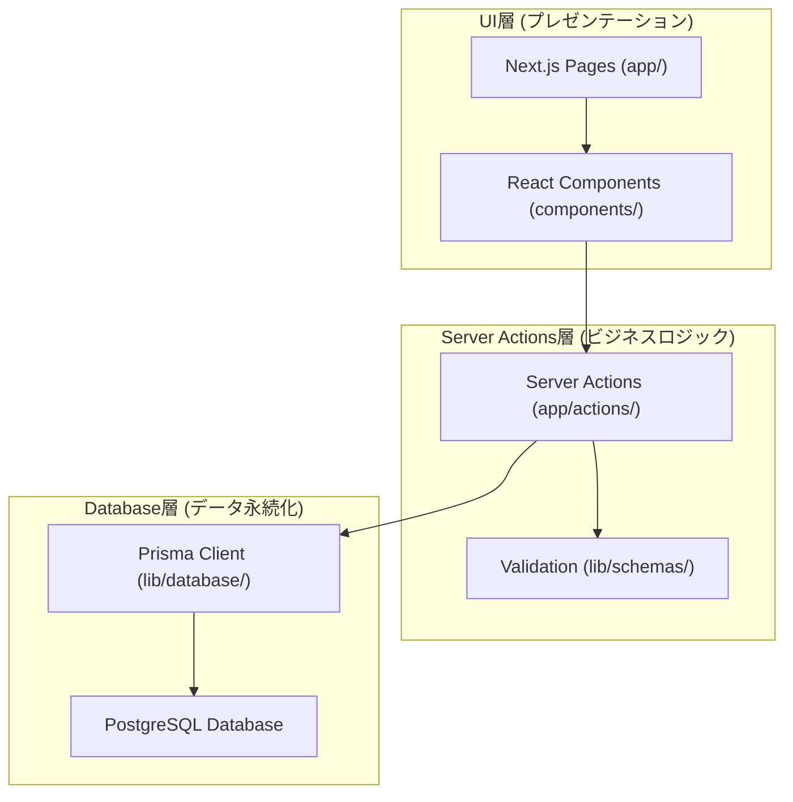
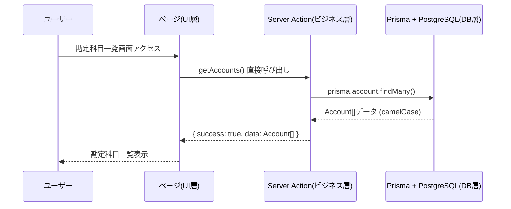
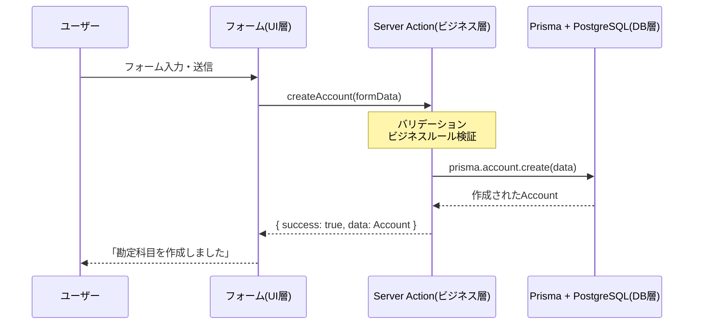

# アーキテクチャ設計

## なぜシンプル3層アーキテクチャなのか？

### アーキテクチャ選択の背景

会計システムには複雑な要求がありますが、個人開発では以下を重視します：

- **開発速度**: 迅速な機能実装とプロトタイピング
- **保守性**: 一人で理解・保守可能な複雑さ
- **型安全性**: バグの早期発見と安全な開発
- **学習コスト**: 新しい技術の習得負荷最小化

これらを実現するために、**責務を3つの層に分離**します。

### 3層に分ける理由

#### 複雑な多層アーキテクチャの問題

```typescript
// 従来の複雑な例
function createAccount() {
  // プレゼンテーション層
  // → アプリケーション層  
  // → ドメイン層
  // → リポジトリ層
  // → インフラ層
  // 5層を経由して複雑化
}
```

#### シンプル3層の利点

```typescript
// 簡素化された良い例

// UI層: 画面表示のみ
function AccountForm() {
  return <form onSubmit={handleSubmit}>...</form>;
}

// Server Actions層: ビジネスロジック + データ操作
async function createAccount(data) {
  // バリデーション
  const result = createAccountSchema.safeParse(data);
  
  // ビジネスルール
  if (await isDuplicateCode(result.data.accountCode)) {
    throw new Error("重複");
  }
  
  // データベース操作
  return await prisma.account.create({ data: result.data });
}

// Database層: Prismaによる型安全なアクセス
// prisma.account.create(...) // 自動生成される型安全なクライアント
```

## 全体アーキテクチャ

Biz Clone は、**シンプル3層アーキテクチャ**を採用し、個人開発に最適化されています。



## 各層の詳細な責務と実装

### 1. UI層 - 「ユーザーとの接点」

**場所**: `app/`, `components/`  
**役割**: ユーザーが見る画面と操作を担当

#### なぜこの層が必要か？

- ユーザーの操作（クリック、入力）を受け取る
- 業務データを分かりやすい形で表示する
- レスポンシブデザインへの対応

#### 具体的な実装例

```typescript
// app/master/accounts/page.tsx
// 勘定科目の一覧画面
export default async function AccountsPage() {
  // この層では「画面に何を表示するか」のみを決定
  const result = await getAccounts(); // Server Actionを直接呼び出し

  if (!result.success) {
    return <div>エラー: {result.error}</div>;
  }

  return (
    <div>
      <h1>勘定科目管理</h1>
      <AccountList accounts={result.data} />
      <CreateAccountButton />
    </div>
  );
}
```

```typescript
// components/accounting/AccountForm.tsx
// 勘定科目の入力フォーム
export function AccountForm() {
  const { register, handleSubmit, formState: { errors } } = useForm<AccountCreateData>();

  const onSubmit = async (data: AccountCreateData) => {
    // Server Actionを直接呼び出し
    const result = await createAccount(new FormData(...));
    if (result.success) {
      // 成功処理
    }
  };

  return (
    <form onSubmit={handleSubmit(onSubmit)}>
      <Input label="勘定科目コード" {...register("accountCode")} />
      <Input label="勘定科目名" {...register("accountName")} />
      <Select label="科目区分" {...register("accountType")} />
      <Button type="submit">作成</Button>
    </form>
  );
}
```

#### この層の責務

- ✅ **やること**: フォームの表示、ボタンの配置、エラーメッセージの表示
- ❌ **やらないこと**: ビジネスルールの判定、データベースへの保存

### 2. Server Actions層 - 「ビジネスロジックの中核」

**場所**: `app/actions/`, `lib/schemas/`  
**役割**: 業務ルールの実装とデータ操作

#### なぜこの層が必要か？

- 複式簿記のルール実装
- データバリデーション
- トランザクション管理
- セキュリティ（サーバーサイド実行）

#### 具体的な実装例

```typescript
// app/actions/accounts.ts
"use server";

import { prisma } from "@/lib/database/prisma";
import { createAccountSchema } from "@/lib/schemas/master";

export async function createAccount(formData: FormData) {
  try {
    // 1. フォームデータの抽出
    const data = {
      accountCode: formData.get("accountCode") as string,
      accountName: formData.get("accountName") as string,
      accountType: formData.get("accountType") as string,
    };

    // 2. バリデーション
    const result = createAccountSchema.safeParse(data);
    if (!result.success) {
      return { success: false, error: "入力値が正しくありません" };
    }

    // 3. ビジネスルール検証
    const existing = await prisma.account.findUnique({
      where: { accountCode: result.data.accountCode }
    });
    if (existing) {
      return { success: false, error: "この勘定科目コードは既に使用されています" };
    }

    // 4. データベース操作
    const account = await prisma.account.create({
      data: {
        accountCode: result.data.accountCode,
        accountName: result.data.accountName,
        accountType: result.data.accountType,
        isActive: true,
      },
    });

    // 5. 成功レスポンス
    revalidatePath("/master/accounts");
    return { success: true, data: account };
  } catch (error) {
    console.error("勘定科目作成エラー:", error);
    return { success: false, error: "勘定科目の作成に失敗しました" };
  }
}
```

#### バリデーションスキーマ

```typescript
// lib/schemas/master/account.ts
import { z } from "zod";

export const createAccountSchema = z.object({
  accountCode: z
    .string()
    .min(3, "勘定科目コードは3文字以上で入力してください")
    .max(10, "勘定科目コードは10文字以下で入力してください")
    .regex(/^[A-Z0-9]+$/, "勘定科目コードは英数字で入力してください"),

  accountName: z
    .string()
    .min(1, "勘定科目名は必須です")
    .max(100, "勘定科目名は100文字以下で入力してください"),

  accountType: z.enum(["資産", "負債", "資本", "収益", "費用"]),
});
```

#### この層の責務

- ✅ **やること**: バリデーション、ビジネスルール実装、トランザクション管理
- ❌ **やらないこと**: 画面表示、UI状態管理

### 3. Database層 - 「データの永続化」

**場所**: `lib/database/`, `prisma/`  
**役割**: データベースへの安全なアクセス

#### なぜこの層が必要か？

- データの型安全性保証
- SQLインジェクション防止
- パフォーマンス最適化
- マイグレーション管理

#### 具体的な実装例

**Prismaクライアント設定**

```typescript
// lib/database/prisma.ts
import { PrismaClient } from '@prisma/client';

const globalForPrisma = globalThis as unknown as {
  prisma: PrismaClient | undefined;
};

export const prisma = globalForPrisma.prisma ?? new PrismaClient();

if (process.env.NODE_ENV !== 'production') globalForPrisma.prisma = prisma;
```

**データベーススキーマ**

```prisma
// prisma/schema.prisma
model Account {
  accountCode String  @id @map("account_code")
  accountName String  @map("account_name")
  accountType String  @map("account_type")
  isActive    Boolean @default(true) @map("is_active")
  createdAt   DateTime @default(now()) @map("created_at")
  updatedAt   DateTime @updatedAt @map("updated_at")

  @@map("accounts")
}
```

**統一型定義**

```typescript
// types/unified.ts
import type { Account, Partner, AnalysisCode } from "@/lib/database/prisma";

export type { Account, Partner, AnalysisCode };

// Server Action共通レスポンス型
export interface ActionResult<T = any> {
  success: boolean;
  data?: T;
  error?: string;
}
```

#### この層の責務

- ✅ **やること**: SQL実行、型変換、パフォーマンス最適化
- ❌ **やらないこと**: ビジネスルールの判定、UI表示

## データフロー: 実際の処理の流れ

### 1. 読み取り処理（Query）- 勘定科目一覧の表示



### 2. 書き込み処理（Command）- 新しい勘定科目の作成



## 簡素化による具体的なメリット

### 改善前の問題（複雑な多層構造）

```typescript
// 改善前: 複数の抽象化層を経由
async function createAccount(data) {
  // 1. アプリケーション層
  const service = serviceFactory.createAccountService();
  
  // 2. サービス層
  const repository = repositoryFactory.createAccountRepository();
  
  // 3. リポジトリ層
  const dataAccessLayer = DataAccessLayer.getInstance();
  
  // 4. 型変換
  const convertedData = typeConverter.snakeToCamel(data);
  
  // 複雑で追跡困難
}
```

### 改善後の統一されたアーキテクチャ

```typescript
// 改善後: 直接的で追跡しやすい
async function createAccount(formData: FormData) {
  // 1. バリデーション
  const result = createAccountSchema.safeParse(extractedData);
  
  // 2. ビジネスルール
  if (await isDuplicate(result.data.accountCode)) {
    return { success: false, error: "重複" };
  }
  
  // 3. データベース操作
  const account = await prisma.account.create({ data: result.data });
  
  return { success: true, data: account };
}
```

### 実現された具体的なメリット

#### 1. 開発速度の向上

- **改善前**: 新機能追加に複数ファイルの修正が必要
- **改善後**: Server Actions内で完結する実装

#### 2. 理解しやすさ

- **改善前**: データフローが複数の抽象化層を経由
- **改善後**: UI → Server Actions → Database の明確なフロー

#### 3. デバッグの容易さ

- **改善前**: エラーの発生箇所特定が困難
- **改善後**: 各層の責務が明確でバグの特定が迅速

#### 4. テストの書きやすさ

- **改善前**: モックの設定が複雑
- **改善後**: Server Actions単体でテスト可能

## 技術的特徴

### 1. 型安全性

**Prisma統一型システム**

```typescript
// 統一されたcamelCase型定義
const account: Account = {
  accountCode: "TEST001",
  accountName: "テスト科目",
  accountType: "資産", // 列挙型で安全
};
```

**実行時バリデーション**

```typescript
// Zod により実行時にもデータ整合性を保証
const result = createAccountSchema.safeParse(inputData);
if (!result.success) {
  throw new Error(`バリデーションエラー: ${result.error.message}`);
}
```

### 2. パフォーマンス

**Prismaによる最適化**

```typescript
// 効率的なクエリ生成
const accounts = await prisma.account.findMany({
  where: { isActive: true },
  select: { accountCode: true, accountName: true }, // 必要な列のみ
  orderBy: { accountCode: "asc" },
});
```

### 3. 保守性

**明確な責務分離**

- UI層: 画面表示のみ
- Server Actions層: ビジネスロジックのみ  
- Database層: データアクセスのみ

### 4. 拡張性

**新機能の追加例**

```typescript
// 新しいServer Actionの追加
export async function createPartner(formData: FormData) {
  // 同じパターンで実装
  const result = createPartnerSchema.safeParse(data);
  // ...
  return await prisma.partner.create({ data: result.data });
}
```

## フォルダ構造の詳細

```
app/
├── actions/                    # Server Actions (ビジネスロジック)
│   ├── accounts.ts            # 勘定科目操作
│   ├── partners.ts            # 取引先操作
│   ├── analysis-codes.ts      # 分析コード操作
│   └── sub-accounts.ts        # 補助科目操作
├── master/                    # マスタ管理画面 (UI層)
│   ├── accounts/
│   │   └── page.tsx
│   ├── partners/
│   │   └── page.tsx
│   └── analysis-codes/
│       └── page.tsx
└── siwake/                    # 仕訳画面 (UI層)
    ├── page.tsx
    └── new/
        └── page.tsx

components/
├── accounting/                # 会計特化コンポーネント (UI層)
│   ├── account-master-form.tsx
│   ├── account-master-list.tsx
│   └── journal-entry-form.tsx
└── ui/                       # 基本UI (UI層)

lib/
├── database/                 # Database層
│   ├── prisma.ts            # Prismaクライアント
│   ├── journal.ts           # 仕訳サービス
│   └── journal-number.ts    # 仕訳番号管理
├── schemas/                  # バリデーション (Server Actions層)
│   ├── master/
│   │   ├── account.ts
│   │   ├── partner.ts
│   │   └── analysis-code.ts
│   └── journal.ts
└── utils/                    # ユーティリティ
    ├── error-handler.ts
    └── search-filter.ts

types/                        # 統一型定義
└── unified.ts               # Prismaベースの型定義
```

この3層アーキテクチャにより、個人開発に最適化された、理解しやすく保守しやすい会計システムを構築できます。