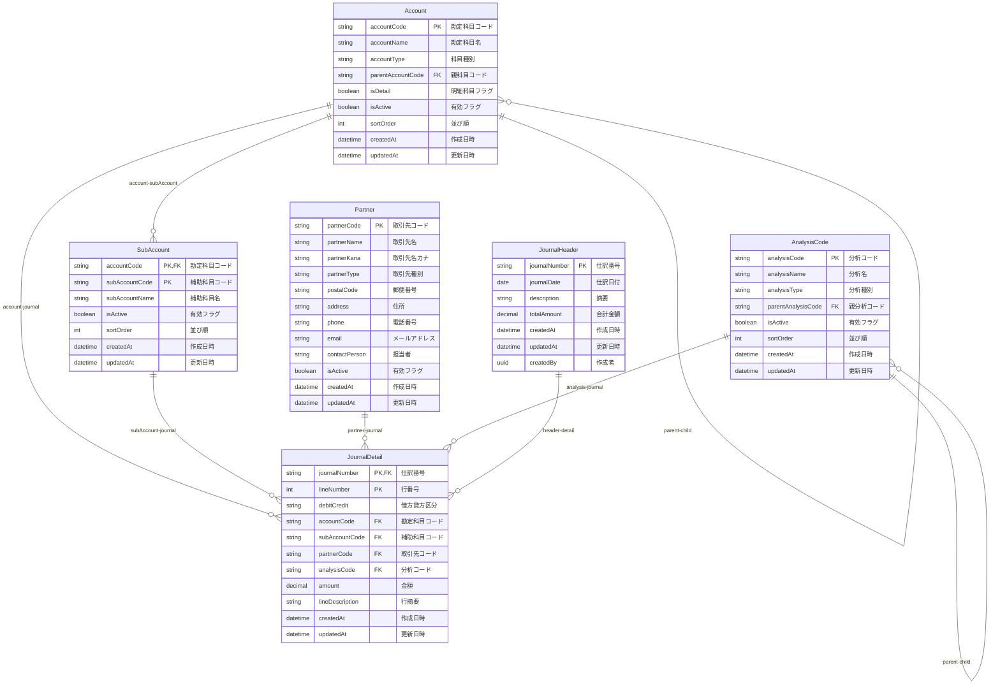
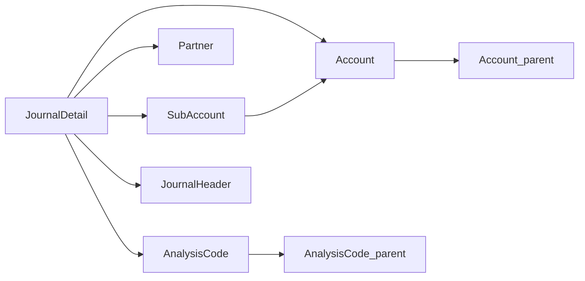

# データベース設計

## 概要

Biz Clone のデータベースは、**PostgreSQL**をベースとし、**Prisma ORM**で管理されています。  
会計システムに必要な複式簿記の概念を正確にモデル化した設計となっています。

## 技術スタック

- **データベース**: PostgreSQL
- **ORM**: Prisma 6.9.0
- **ホスティング**: Supabase
- **マイグレーション**: Prisma Migrate

## データベース構造概要



## テーブル詳細

### 1. マスタテーブル群

#### Account（勘定科目マスタ）

**目的**: 会計の基本となる勘定科目を管理

| カラム名          | データ型     | 制約         | 説明                                     |
| ----------------- | ------------ | ------------ | ---------------------------------------- |
| accountCode       | VARCHAR(10)  | PK           | 勘定科目コード（例：1101）               |
| accountName       | VARCHAR(100) | NOT NULL     | 勘定科目名（例：現金）                   |
| accountType       | VARCHAR(20)  | NOT NULL     | 科目種別（資産、負債、資本、収益、費用） |
| parentAccountCode | VARCHAR(10)  | FK           | 親科目コード（階層構造用）               |
| isDetail          | BOOLEAN      | DEFAULT true | 明細科目フラグ                           |
| isActive          | BOOLEAN      | DEFAULT true | 有効フラグ                               |
| sortOrder         | INTEGER      | -            | 表示順序                                 |

**特徴**:

- 自己参照による階層構造サポート
- 勘定科目の階層管理（例：流動資産 > 現金・預金 > 現金）

#### SubAccount（補助科目マスタ）

**目的**: 勘定科目をさらに詳細に分類

| カラム名       | データ型     | 制約     | 説明           |
| -------------- | ------------ | -------- | -------------- |
| accountCode    | VARCHAR(10)  | PK, FK   | 勘定科目コード |
| subAccountCode | VARCHAR(15)  | PK       | 補助科目コード |
| subAccountName | VARCHAR(100) | NOT NULL | 補助科目名     |

**特徴**:

- 複合主キー（勘定科目コード + 補助科目コード）
- 例：売掛金（勘定科目）> A 社売掛金（補助科目）

#### Partner（取引先マスタ）

**目的**: 取引先情報の管理

| カラム名      | データ型     | 制約     | 説明                           |
| ------------- | ------------ | -------- | ------------------------------ |
| partnerCode   | VARCHAR(15)  | PK       | 取引先コード                   |
| partnerName   | VARCHAR(100) | NOT NULL | 取引先名                       |
| partnerType   | VARCHAR(20)  | NOT NULL | 取引先種別（得意先、仕入先等） |
| address       | VARCHAR(200) | -        | 住所                           |
| contactPerson | VARCHAR(50)  | -        | 担当者名                       |

#### AnalysisCode（分析コードマスタ）

**目的**: 部門・プロジェクト等の管理会計用分析軸

| カラム名     | データ型     | 制約     | 説明                             |
| ------------ | ------------ | -------- | -------------------------------- |
| analysisCode | VARCHAR(15)  | PK       | 分析コード                       |
| analysisName | VARCHAR(100) | NOT NULL | 分析名                           |
| analysisType | VARCHAR(20)  | NOT NULL | 分析種別（部門、プロジェクト等） |

### 2. 仕訳テーブル群

#### JournalHeader（仕訳ヘッダ）

**目的**: 仕訳の基本情報を管理

| カラム名      | データ型      | 制約      | 説明                 |
| ------------- | ------------- | --------- | -------------------- |
| journalNumber | VARCHAR(15)   | PK        | 仕訳番号（自動採番） |
| journalDate   | DATE          | NOT NULL  | 仕訳日付             |
| description   | TEXT          | -         | 仕訳摘要             |
| totalAmount   | DECIMAL(15,2) | DEFAULT 0 | 合計金額             |
| createdBy     | UUID          | -         | 作成者 ID            |

#### JournalDetail（仕訳明細）

**目的**: 仕訳の詳細な借方貸方情報を管理

| カラム名      | データ型      | 制約     | 説明                |
| ------------- | ------------- | -------- | ------------------- |
| journalNumber | VARCHAR(15)   | PK, FK   | 仕訳番号            |
| lineNumber    | INTEGER       | PK       | 行番号              |
| debitCredit   | VARCHAR(1)    | NOT NULL | 借方貸方区分（D/C） |
| accountCode   | VARCHAR(10)   | FK       | 勘定科目コード      |
| amount        | DECIMAL(15,2) | NOT NULL | 金額                |

**特徴**:

- 複合主キー（仕訳番号 + 行番号）
- 複式簿記の借方貸方を正確に表現
- 外部キー制約により参照整合性を保証

## 制約とビジネスルール

### 1. データ整合性制約

#### 仕訳データ

- 借方合計 = 貸方合計（複式簿記の基本原則）
- 仕訳日付は未来日不可
- 金額は正数のみ（借方貸方区分で表現）

#### マスタデータ

- 勘定科目コードの一意性
- 取引先コードの一意性
- アクティブフラグによる論理削除

### 2. 参照整合性



### 3. インデックス戦略

```sql
-- 性能向上のための主要インデックス
CREATE INDEX idx_journal_detail_date ON journal_details(journal_date);
CREATE INDEX idx_journal_detail_account ON journal_details(account_code);
CREATE INDEX idx_journal_detail_partner ON journal_details(partner_code);
CREATE INDEX idx_account_type ON accounts(account_type);
CREATE INDEX idx_partner_type ON partners(partner_type);
```

## マイグレーション管理

### Prisma マイグレーション

- **場所**: `prisma/migrations/`
- **最新**: `20250609094419_init_with_composite_keys`
- **特徴**: 複合主キーを正しく実装

### マイグレーションワークフロー

1. スキーマ変更 (`prisma/schema.prisma`)
2. マイグレーション生成 (`prisma migrate dev`)
3. 本番適用 (`prisma migrate deploy`)

## 接続設定

### 環境変数

- `DATABASE_URL`: Supabase 接続 URL
- `DIRECT_URL`: 直接接続 URL（マイグレーション用）

### Prisma クライアント

- **場所**: `lib/generated/prisma/`
- **生成**: 自動生成（`prisma generate`）
- **特徴**: 型安全なデータベースアクセス

## パフォーマンス考慮事項

### 1. クエリ最適化

- 必要なフィールドのみ選択（`select`文）
- 適切な`include`と`where`条件
- ページネーション実装

### 2. インデックス戦略

- 検索頻度の高いカラムにインデックス
- 複合インデックスの活用
- パフォーマンスモニタリング

### 3. 接続プール

- Supabase の接続プール活用
- 適切なタイムアウト設定
