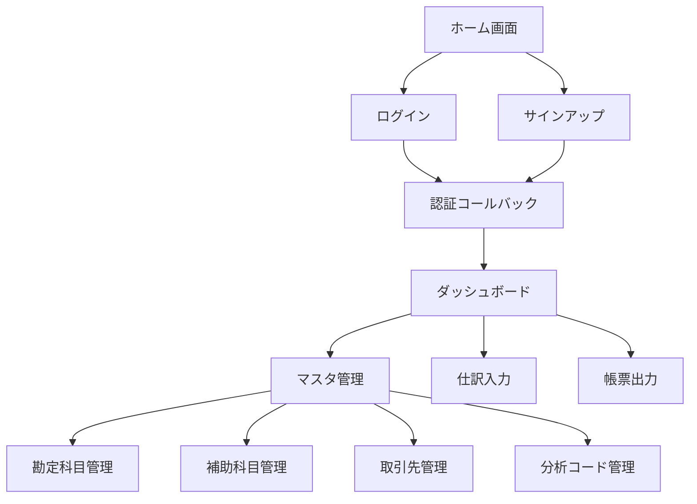

# フロントエンド構造

## 概要

Biz Clone のフロントエンドは Next.js 15 の App Router を採用し、現代的な React アプリケーションとして構築されています。  
**Shadcn/UI**を基盤としたデザインシステムにより、統一感のある UI を実現しています。

## 技術スタック

### コアフレームワーク

- **Next.js 15.3.3** - App Router 使用
- **React 19** - Server Components & Client Components
- **TypeScript** - 型安全な開発

### UI ライブラリ

- **Shadcn/UI** - コンポーネントライブラリ
- **Radix UI** - アクセシブルなプリミティブ
- **Tailwind CSS** - ユーティリティファースト CSS
- **Lucide React** - アイコンライブラリ

### 状態管理・フォーム

- **React Hook Form** - フォーム管理
- **Zod** - バリデーション
- **Tanstack Table** - テーブル表示

## ディレクトリ構造

```
app/                      # Next.js App Router
├── auth/                 # 認証関連
│   └── callback/         # 認証コールバック
├── master/               # マスタ管理画面
│   ├── accounts/         # 勘定科目管理
│   ├── sub-accounts/     # 補助科目管理
│   ├── partners/         # 取引先管理
│   └── analysis-codes/   # 分析コード管理
├── login/                # ログイン画面
├── signup/               # サインアップ画面
├── lib/                  # Server Actions
│   └── actions/          # フォーム処理
├── layout.tsx            # ルートレイアウト
├── page.tsx              # ホーム画面
└── globals.css           # グローバルスタイル

components/               # 再利用可能コンポーネント
├── ui/                   # 基本UIコンポーネント
├── layout/               # レイアウトコンポーネント
├── accounting/           # 業務特化コンポーネント
└── providers/            # Contextプロバイダー
```

## ページ構成

### 1. 画面フロー図



### 2. 主要画面

#### ホーム画面 (`app/page.tsx`)

- **目的**: システムの概要説明とナビゲーション
- **特徴**: レスポンシブデザイン、シンプルなランディング

#### 認証システム

- **ログイン** (`app/login/`)
- **サインアップ** (`app/signup/`)
- **コールバック** (`app/auth/callback/`)
- **技術**: Supabase Auth

#### マスタ管理画面群 (`app/master/`)

各マスタ管理画面は統一された構造を持ちます：

```typescript
// 共通の画面構造
interface MasterPageStructure {
  list: "一覧表示・検索";
  create: "新規作成フォーム";
  edit: "編集フォーム";
  detail: "詳細表示";
}
```

## コンポーネント設計

### 1. UI コンポーネント (`components/ui/`)

Shadcn/UI ベースの基本コンポーネント：

```
ui/
├── button.tsx           # ボタンコンポーネント
├── input.tsx            # 入力フィールド
├── form.tsx             # フォーム関連
├── table.tsx            # テーブル表示
├── dialog.tsx           # モーダル・ダイアログ
├── select.tsx           # セレクトボックス
├── alert-dialog.tsx     # 確認ダイアログ
├── avatar.tsx           # アバター表示
├── dropdown-menu.tsx    # ドロップダウンメニュー
├── label.tsx            # ラベル
├── menubar.tsx          # メニューバー
├── navigation-menu.tsx  # ナビゲーションメニュー
├── popover.tsx          # ポップオーバー
├── sonner.tsx           # トースト通知
└── switch.tsx           # スイッチ
```

### 2. レイアウトコンポーネント (`components/layout/`)

```typescript
// ヘッダーコンポーネント例
interface HeaderProps {
  user?: User | null;
  showNavigation?: boolean;
}

export function Header({ user, showNavigation = true }: HeaderProps) {
  // ナビゲーション、ユーザー情報、テーマ切り替え等
}
```

### 3. 業務コンポーネント (`components/accounting/`)

会計システム特化のコンポーネント：

```
accounting/
├── account-selector.tsx      # 勘定科目選択
├── journal-form.tsx          # 仕訳入力フォーム
├── amount-input.tsx          # 金額入力
├── date-picker.tsx           # 日付選択
├── partner-selector.tsx      # 取引先選択
└── analysis-code-selector.tsx # 分析コード選択
```

## 状態管理パターン詳細解説

### なぜこの状態管理方式を選んだのか？

従来の React アプリでは、**クライアントサイドでの状態管理**（Redux、Zustand など）が主流でした。  
しかし、会計システムには以下の要求があります：

- **データの一貫性**: 複数ユーザーが同時に同じデータを見ている必要がある
- **セキュリティ**: 金銭データはサーバーで検証・処理する必要がある
- **パフォーマンス**: 大量の会計データを効率的に表示する必要がある

これらの要求に対応するため、**Server-First** な状態管理パターンを採用しています。

### 1. Server Components vs Client Components の戦略的使い分け

#### Server Components（サーバーコンポーネント）の活用

**用途**: データ表示中心の画面

```typescript
// app/master/accounts/page.tsx
// データベースから直接データを取得してレンダリング
async function AccountListPage() {
  // サーバーで実行されるため、データベースアクセスが高速
  const accounts = await getAccounts();

  return (
    <div>
      <h1>勘定科目一覧</h1>
      {/* サーバーでHTMLが生成されるため初期表示が高速 */}
      <AccountList accounts={accounts} />
    </div>
  );
}
```

**メリット**:

- **初期表示の高速化**: サーバーで HTML が生成済み
- **SEO フレンドリー**: 検索エンジンがコンテンツを認識可能
- **セキュリティ**: データベースアクセスがサーバー内で完結
- **軽量**: JavaScript バンドルサイズが小さい

#### Client Components（クライアントコンポーネント）の限定利用

**用途**: ユーザーインタラクション中心の機能

```typescript
// components/accounting/AccountForm.tsx
"use client"; // 明示的にクライアントコンポーネントとして指定

function AccountForm({ onSubmit }: Props) {
  // クライアントサイドの状態管理
  const [isLoading, setIsLoading] = useState(false);
  const [errors, setErrors] = useState<string[]>([]);

  const handleSubmit = async (data: FormData) => {
    setIsLoading(true);
    setErrors([]);

    try {
      // Server Action を呼び出し
      await createAccountAction(data);
    } catch (error) {
      setErrors([error.message]);
    } finally {
      setIsLoading(false);
    }
  };

  return (
    <form onSubmit={handleSubmit}>
      {/* リアルタイムバリデーション */}
      <AccountCodeInput
        onChange={(code) => validateCodeFormat(code)}
        disabled={isLoading}
      />

      {/* エラー表示 */}
      {errors.map((error) => (
        <ErrorMessage key={error}>{error}</ErrorMessage>
      ))}

      {/* ローディング状態 */}
      <Button disabled={isLoading}>
        {isLoading ? "作成中..." : "勘定科目を作成"}
      </Button>
    </form>
  );
}
```

**使用基準**:

- ✅ **Client Components**: フォーム入力、モーダル、リアルタイム更新
- ✅ **Server Components**: データ表示、静的コンテンツ、SEO が重要な部分

### 2. Server Actions パターンによる安全な状態更新

#### TASK23 で実装した統一 Server Actions

```typescript
// app/lib/actions/master-unified.ts
"use server";

export async function createAccountAction(
  formData: FormData
): Promise<ActionResult> {
  try {
    // 1. 入力データの抽出・変換
    const rawData = extractFormData(formData, accountCreateSchema);

    // 2. 統一データアクセス層経由でビジネスロジック実行
    const dal = DataAccessLayer.getInstance();
    const { account: accountService } = dal.getServices();

    // 3. サーバーサイドでビジネスルール検証
    const validatedData = await accountService.validateForCreate(rawData);

    // 4. データベース更新（トランザクション内で実行）
    const result = await accountService.createAccount(validatedData);

    // 5. 成功時は画面を再読み込み（最新データを表示）
    revalidatePath("/master/accounts");

    return {
      success: true,
      data: result,
      message: "勘定科目を作成しました",
    };
  } catch (error) {
    // 6. エラーハンドリング
    return {
      success: false,
      error: error.message,
    };
  }
}
```

#### Server Actions の重要な利点

**セキュリティ**

```typescript
// クライアントサイドからは直接データベースにアクセス不可
// すべてのデータ操作がサーバーで検証される

export async function deleteAccountAction(accountCode: string) {
  // 認証チェック
  const user = await getCurrentUser();
  if (!user) throw new Error("未認証");

  // 権限チェック
  if (!user.hasPermission("ACCOUNT_DELETE")) {
    throw new Error("権限がありません");
  }

  // ビジネスルール検証
  const canDelete = await accountService.canDelete(accountCode);
  if (!canDelete) {
    throw new Error("使用中の勘定科目は削除できません");
  }

  // 削除実行
  await accountService.delete(accountCode);
}
```

**データの一貫性**

```typescript
// 複数のテーブルを同時に更新する場合のトランザクション管理
export async function moveAccountAction(
  accountCode: string,
  newParentCode: string
) {
  const dal = DataAccessLayer.getInstance();
  const { account: accountService } = dal.getServices();

  // トランザクション内で複数操作を実行
  await accountService.withTransaction(async (tx) => {
    // 1. 親子関係の更新
    await tx.updateParentChild(accountCode, newParentCode);

    // 2. ソート順の再計算
    await tx.recalculateSortOrder(newParentCode);

    // 3. 監査ログの記録
    await tx.createAuditLog({
      action: "ACCOUNT_MOVE",
      accountCode,
      details: { newParentCode },
    });
  });
}
```

### 3. フォーム管理の最適化パターン

#### React Hook Form + Zod による型安全なフォーム

```typescript
// components/accounting/AccountForm.tsx
"use client";

function AccountForm() {
  // 型安全なフォーム定義
  const form = useForm<AccountFormData>({
    resolver: zodResolver(accountCreateSchema), // Zodスキーマでバリデーション
    defaultValues: {
      accountCode: "",
      accountName: "",
      accountType: "ASSET",
      isDetail: false,
      isActive: true,
    },
  });

  // リアルタイムバリデーション
  const watchedAccountCode = form.watch("accountCode");

  useEffect(() => {
    if (watchedAccountCode.length >= 3) {
      // 勘定科目コードの重複チェック（debounce）
      debouncedCheckDuplicate(watchedAccountCode);
    }
  }, [watchedAccountCode]);

  const onSubmit = async (data: AccountFormData) => {
    try {
      // Server Action 呼び出し
      const result = await createAccountAction(data);

      if (result.success) {
        // 成功時の処理
        toast.success(result.message);
        form.reset(); // フォームクリア
        router.push("/master/accounts"); // リダイレクト
      } else {
        // エラー時の処理
        toast.error(result.error);
      }
    } catch (error) {
      toast.error("予期せぬエラーが発生しました");
    }
  };

  return (
    <Form {...form}>
      <form onSubmit={form.handleSubmit(onSubmit)} className="space-y-4">
        {/* 勘定科目コード */}
        <FormField
          control={form.control}
          name="accountCode"
          render={({ field }) => (
            <FormItem>
              <FormLabel>勘定科目コード *</FormLabel>
              <FormControl>
                <Input {...field} placeholder="例: 1010" maxLength={10} />
              </FormControl>
              <FormDescription>
                3-10文字の英数字で入力してください
              </FormDescription>
              <FormMessage />
            </FormItem>
          )}
        />

        {/* 勘定科目名 */}
        <FormField
          control={form.control}
          name="accountName"
          render={({ field }) => (
            <FormItem>
              <FormLabel>勘定科目名 *</FormLabel>
              <FormControl>
                <Input {...field} placeholder="例: 現金" maxLength={50} />
              </FormControl>
              <FormMessage />
            </FormItem>
          )}
        />

        {/* 科目区分 */}
        <FormField
          control={form.control}
          name="accountType"
          render={({ field }) => (
            <FormItem>
              <FormLabel>科目区分 *</FormLabel>
              <Select onValueChange={field.onChange} defaultValue={field.value}>
                <FormControl>
                  <SelectTrigger>
                    <SelectValue placeholder="科目区分を選択" />
                  </SelectTrigger>
                </FormControl>
                <SelectContent>
                  <SelectItem value="ASSET">資産</SelectItem>
                  <SelectItem value="LIABILITY">負債</SelectItem>
                  <SelectItem value="EQUITY">資本</SelectItem>
                  <SelectItem value="REVENUE">収益</SelectItem>
                  <SelectItem value="EXPENSE">費用</SelectItem>
                </SelectContent>
              </Select>
              <FormMessage />
            </FormItem>
          )}
        />

        {/* 送信ボタン */}
        <Button
          type="submit"
          disabled={form.formState.isSubmitting}
          className="w-full"
        >
          {form.formState.isSubmitting ? (
            <>
              <Loader2 className="mr-2 h-4 w-4 animate-spin" />
              作成中...
            </>
          ) : (
            "勘定科目を作成"
          )}
        </Button>
      </form>
    </Form>
  );
}
```

### 4. 最適な状態管理の選択指針

#### 状態の種類と管理場所

```typescript
// 🌐 サーバー状態 → Server Components + Server Actions
interface ServerState {
  accounts: Account[]; // データベースから取得
  partners: Partner[]; // データベースから取得
  currentUser: User; // 認証状態
}

// 📱 クライアント状態 → useState, useReducer
interface ClientState {
  isLoading: boolean; // 読み込み状態
  errors: string[]; // エラーメッセージ
  formData: FormData; // フォーム入力値
  isModalOpen: boolean; // モーダル表示状態
}

// 🎨 UI状態 → CSS変数, Tailwind
interface UIState {
  theme: "light" | "dark"; // テーマ
  sidebarOpen: boolean; // サイドバー状態
  activeTab: string; // アクティブタブ
}
```

#### パフォーマンス最適化のポイント

**1. データフェッチの最適化**

```typescript
// 悪い例: クライアントサイドでの非効率なデータ取得
function BadAccountList() {
  const [accounts, setAccounts] = useState([]);

  useEffect(() => {
    fetch('/api/accounts')  // クライアント → サーバー → データベース
      .then(res => res.json())
      .then(setAccounts);
  }, []);

  return <div>{accounts.map(...)}</div>;
}

// 良い例: Server Componentでの効率的なデータ取得
async function GoodAccountList() {
  // サーバー → データベース（直接接続）
  const accounts = await getAccounts();

  return <div>{accounts.map(...)}</div>;
}
```

**2. 必要最小限のクライアント状態**

```typescript
// 悪い例: 全てをクライアントサイドで管理
const [allAccounts, setAllAccounts] = useState([]);
const [filteredAccounts, setFilteredAccounts] = useState([]);
const [searchTerm, setSearchTerm] = useState("");

// 良い例: サーバーサイドでフィルタリング
function AccountSearch() {
  const [searchTerm, setSearchTerm] = useState(""); // クライアント状態は最小限

  return (
    <form action={searchAccountsAction}>
      <input
        name="searchTerm"
        value={searchTerm}
        onChange={(e) => setSearchTerm(e.target.value)}
      />
    </form>
  );
}
```

**3. 適切なキャッシュ戦略**

```typescript
// Server Actions での適切なキャッシュ制御
export async function updateAccountAction(data: AccountUpdateDto) {
  await accountService.update(data);

  // 関連するページのキャッシュを無効化
  revalidatePath("/master/accounts"); // 一覧ページ
  revalidatePath(`/master/accounts/${data.id}`); // 詳細ページ
  revalidateTag("accounts"); // accounts タグのページ全て
}
```

この状態管理パターンにより、パフォーマンスとセキュリティを両立した、スケーラブルな会計システムを実現しています。

## デザインシステム

### 1. カラーパレット

- **Primary**: ブランドカラー
- **Secondary**: セカンダリカラー
- **Muted**: 補助的な情報
- **Destructive**: エラー・削除系
- **Border**: 境界線
- **Background**: 背景色

### 2. タイポグラフィ

- **見出し**: `h1`〜`h4`（Geist Sans）
- **本文**: `p`, `span`（Geist Sans）
- **コード**: `code`（Geist Mono）

### 3. スペーシング

Tailwind CSS のスペーシングシステムを採用：

- `p-4`, `m-2`, `space-y-4` など

### 4. レスポンシブデザイン

```css
/* モバイルファースト */
.container {
  @apply px-4 sm:px-6 lg:px-8;
}

/* ブレイクポイント */
/* sm: 640px */
/* md: 768px */
/* lg: 1024px */
/* xl: 1280px */
```

## アクセシビリティ

### 1. Radix UI ベース

- キーボードナビゲーション対応
- スクリーンリーダー対応
- ARIA 属性自動設定

### 2. フォーカス管理

```typescript
// フォーカストラップの実装例
function Modal({ isOpen, onClose }: ModalProps) {
  return (
    <Dialog open={isOpen} onOpenChange={onClose}>
      <DialogContent>{/* 自動的にフォーカストラップが適用 */}</DialogContent>
    </Dialog>
  );
}
```

### 3. カラーコントラスト

- WCAG 2.1 AA 準拠
- ダークモード対応

## パフォーマンス最適化

### 1. 画像最適化

```typescript
import Image from "next/image";

function Logo() {
  return (
    <Image src="/logo.png" alt="Biz Clone" width={120} height={40} priority />
  );
}
```

### 2. コード分割

```typescript
// 動的インポート
const HeavyComponent = dynamic(() => import("./HeavyComponent"), {
  loading: () => <Spinner />,
});
```

### 3. キャッシュ戦略

- Server Components のキャッシュ
- Static Generation での静的生成
- ISR (Incremental Static Regeneration)

## テーマシステム

### 1. ダークモード対応

```typescript
// components/providers/theme-provider.tsx
import { ThemeProvider } from "next-themes";

export function AppThemeProvider({ children }: Props) {
  return (
    <ThemeProvider
      attribute="class"
      defaultTheme="system"
      enableSystem
      disableTransitionOnChange
    >
      {children}
    </ThemeProvider>
  );
}
```

### 2. CSS 変数

```css
:root {
  --background: 0 0% 100%;
  --foreground: 222.2 84% 4.9%;
  --primary: 222.2 47.4% 11.2%;
  /* ... */
}

.dark {
  --background: 222.2 84% 4.9%;
  --foreground: 210 40% 98%;
  --primary: 210 40% 98%;
  /* ... */
}
```

## 国際化対応

### 1. 言語設定

```typescript
// app/layout.tsx
export default function RootLayout({ children }: Props) {
  return (
    <html lang="ja" suppressHydrationWarning>
      {/* ... */}
    </html>
  );
}
```

### 2. 日付・数値フォーマット

```typescript
// 日本語ロケール対応
const formatter = new Intl.NumberFormat("ja-JP", {
  style: "currency",
  currency: "JPY",
});

const dateFormatter = new Intl.DateTimeFormat("ja-JP", {
  year: "numeric",
  month: "long",
  day: "numeric",
});
```
