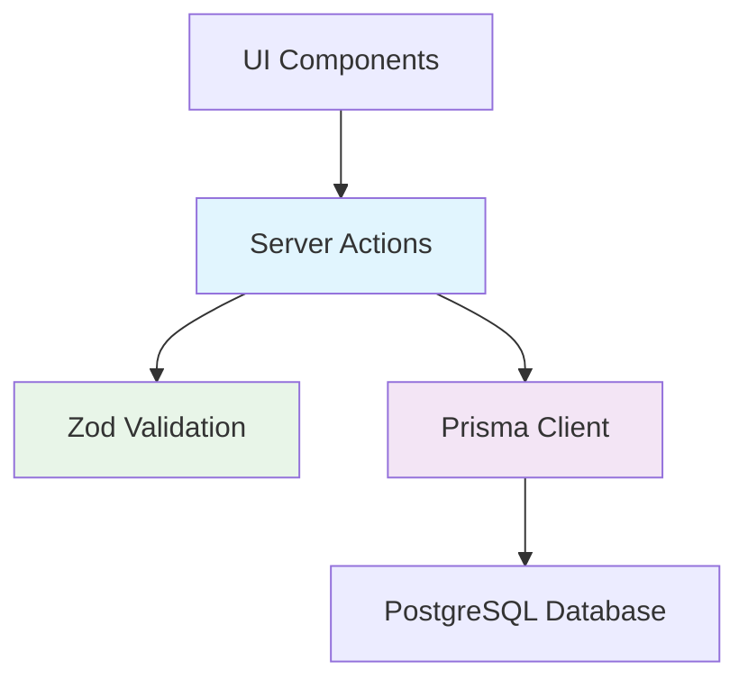

# バックエンド構造

## 概要

Biz Clone のバックエンドは、**シンプル2層アーキテクチャ**に基づいて設計されており、個人開発の効率性を最大化します。  
**Server Actions**と**Prisma**により、直接的で理解しやすい設計となっています。

## アーキテクチャパターン

### 1. 依存関係の方向



### 2. レイヤー構成

#### Server Actions層 (`app/actions/`)

- **責務**: ビジネスロジック + データ操作
- **特徴**: サーバーサイド実行、型安全性、直接的なデータフロー
- **技術**: Next.js 15 Server Actions, TypeScript, Zod

#### Database層 (`lib/database/`)

- **責務**: データアクセスとデータベース接続
- **特徴**: Prisma ORM、統一camelCase型
- **技術**: Prisma, PostgreSQL

#### Validation層 (`lib/schemas/`)

- **責務**: データバリデーション
- **特徴**: 実行時型チェック、エラーメッセージ
- **技術**: Zod

## ディレクトリ構造

```
app/
├── actions/                    # Server Actions (ビジネスロジック)
│   ├── accounts.ts            # 勘定科目の CRUD 操作 + ユニークチェック
│   ├── partners.ts            # 取引先の CRUD 操作 + ユニークチェック
│   ├── analysis-codes.ts      # 分析コードの CRUD 操作 + ユニークチェック
│   ├── sub-accounts.ts        # 補助科目の CRUD 操作 + ユニークチェック
│   ├── journal-save.ts        # 仕訳保存・検証
│   └── master-search.ts       # マスタ統合検索

lib/
├── database/                  # データベース層
│   ├── prisma.ts             # Prisma クライアント設定
│   ├── journal.ts            # 仕訳関連のデータベース操作
│   └── journal-number.ts     # 仕訳番号生成システム
├── schemas/                  # バリデーション層
│   ├── master/               # マスタ系バリデーション
│   │   ├── account.ts        # 勘定科目バリデーション
│   │   ├── partner.ts        # 取引先バリデーション
│   │   ├── analysis-code.ts  # 分析コードバリデーション
│   │   └── sub-account.ts    # 補助科目バリデーション
│   └── journal.ts            # 仕訳バリデーション
└── utils/                    # ユーティリティ
    ├── error-handler.ts      # エラーハンドリング
    └── search-filter.ts      # 検索フィルター
```

## Server Actions 実装

### 1. 基本的なCRUD操作

```typescript
// app/actions/accounts.ts
"use server";

import { revalidatePath } from "next/cache";
import { prisma } from "@/lib/database/prisma";
import { createAccountSchema, updateAccountSchema } from "@/lib/schemas/master";
import type { Account } from "@/lib/database/prisma";

/**
 * 勘定科目一覧の取得
 */
export async function getAccounts(): Promise<
  { success: boolean; data?: Account[]; error?: string }
> {
  try {
    const accounts = await prisma.account.findMany({
      where: { isActive: true },
      orderBy: { accountCode: "asc" },
    });

    return { success: true, data: accounts };
  } catch (error) {
    console.error("勘定科目取得エラー:", error);
    return { success: false, error: "勘定科目の取得に失敗しました" };
  }
}

/**
 * 勘定科目の作成
 */
export async function createAccount(formData: FormData) {
  try {
    // 1. フォームデータの抽出
    const data = {
      accountCode: formData.get("accountCode") as string,
      accountName: formData.get("accountName") as string,
      accountType: formData.get("accountType") as string,
    };

    // 2. バリデーション
    const result = createAccountSchema.safeParse(data);
    if (!result.success) {
      return { success: false, error: "入力値が正しくありません" };
    }

    // 3. ビジネスルール検証
    const existing = await prisma.account.findUnique({
      where: { accountCode: result.data.accountCode }
    });
    if (existing) {
      return { success: false, error: "この勘定科目コードは既に使用されています" };
    }

    // 4. データベース操作
    const account = await prisma.account.create({
      data: {
        accountCode: result.data.accountCode,
        accountName: result.data.accountName,
        accountType: result.data.accountType,
        isActive: true,
      },
    });

    // 5. キャッシュ更新
    revalidatePath("/master/accounts");
    return { success: true, data: account };
  } catch (error) {
    console.error("勘定科目作成エラー:", error);
    return { success: false, error: "勘定科目の作成に失敗しました" };
  }
}

/**
 * 勘定科目の更新
 */
export async function updateAccount(accountCode: string, formData: FormData) {
  try {
    const data = {
      accountName: formData.get("accountName") as string,
      accountType: formData.get("accountType") as string,
    };

    // バリデーション
    const result = updateAccountSchema.safeParse(data);
    if (!result.success) {
      return { success: false, error: "入力値が正しくありません" };
    }

    // データベース更新
    const account = await prisma.account.update({
      where: { accountCode },
      data: result.data,
    });

    revalidatePath("/master/accounts");
    return { success: true, data: account };
  } catch (error) {
    console.error("勘定科目更新エラー:", error);
    return { success: false, error: "勘定科目の更新に失敗しました" };
  }
}

/**
 * 勘定科目の削除（論理削除）
 */
export async function deleteAccount(accountCode: string) {
  try {
    await prisma.account.update({
      where: { accountCode },
      data: { isActive: false },
    });

    revalidatePath("/master/accounts");
    return { success: true };
  } catch (error) {
    console.error("勘定科目削除エラー:", error);
    return { success: false, error: "勘定科目の削除に失敗しました" };
  }
}
```

### 2. 複雑な検索機能

```typescript
/**
 * 勘定科目の高度な検索
 */
export async function searchAccounts(
  searchTerm: string,
  filters: { accountType?: string; isActive?: boolean } = {},
): Promise<{ success: boolean; data?: Account[]; error?: string }> {
  try {
    const accounts = await prisma.account.findMany({
      where: {
        isActive: filters.isActive !== undefined ? filters.isActive : true,
        ...(searchTerm && {
          OR: [
            { accountCode: { contains: searchTerm, mode: "insensitive" } },
            { accountName: { contains: searchTerm, mode: "insensitive" } },
          ],
        }),
        ...(filters.accountType && {
          accountType: filters.accountType,
        }),
      },
      orderBy: { accountCode: "asc" },
    });

    return { success: true, data: accounts };
  } catch (error) {
    console.error("勘定科目検索エラー:", error);
    return { success: false, error: "勘定科目の検索に失敗しました" };
  }
}
```

## バリデーションシステム

### 1. Zod スキーマ

```typescript
// lib/schemas/master/account.ts
import { z } from "zod";

export const createAccountSchema = z.object({
  accountCode: z
    .string()
    .min(3, "勘定科目コードは3文字以上で入力してください")
    .max(10, "勘定科目コードは10文字以下で入力してください")
    .regex(/^[A-Z0-9]+$/, "勘定科目コードは英数字で入力してください"),

  accountName: z
    .string()
    .min(1, "勘定科目名は必須です")
    .max(100, "勘定科目名は100文字以下で入力してください"),

  accountType: z.enum(["資産", "負債", "資本", "収益", "費用"]),
});

export const updateAccountSchema = z.object({
  accountName: z
    .string()
    .min(1, "勘定科目名は必須です")
    .max(100, "勘定科目名は100文字以下で入力してください"),

  accountType: z.enum(["資産", "負債", "資本", "収益", "費用"]),
});

// 型推論
export type AccountCreateData = z.infer<typeof createAccountSchema>;
export type AccountUpdateData = z.infer<typeof updateAccountSchema>;
```

### 2. 共通バリデーション関数

```typescript
// lib/utils/validation.ts
import { z } from "zod";

// 共通のバリデーションルール
export const commonSchemas = {
  code: z
    .string()
    .min(1, "コードは必須です")
    .max(20, "コードは20文字以下で入力してください")
    .regex(/^[A-Z0-9_-]+$/, "コードは英数字、ハイフン、アンダースコアのみ使用可能です"),

  name: z
    .string()
    .min(1, "名前は必須です")
    .max(100, "名前は100文字以下で入力してください"),

  description: z
    .string()
    .max(500, "説明は500文字以下で入力してください")
    .optional(),
};
```

## データベース層実装

### 1. Prismaクライアント設定

```typescript
// lib/database/prisma.ts
import { PrismaClient } from '@prisma/client';

const globalForPrisma = globalThis as unknown as {
  prisma: PrismaClient | undefined;
};

export const prisma = globalForPrisma.prisma ?? new PrismaClient({
  log: process.env.NODE_ENV === 'development' ? ['query', 'error', 'warn'] : ['error'],
});

if (process.env.NODE_ENV !== 'production') globalForPrisma.prisma = prisma;
```

### 2. 仕訳関連の高度なデータ操作

```typescript
// lib/database/journal.ts
import { prisma } from './prisma';
import type { JournalHeader, JournalDetail } from '@prisma/client';

export interface JournalEntryData {
  journalDate: Date;
  description: string;
  journalDetails: Array<{
    accountCode: string;
    subAccountCode?: string;
    partnerCode?: string;
    analysisCode?: string;
    debitAmount: number;
    creditAmount: number;
    description?: string;
  }>;
}

/**
 * 仕訳の作成（トランザクション処理）
 */
export async function createJournalEntry(data: JournalEntryData) {
  return await prisma.$transaction(async (tx) => {
    // 1. 仕訳番号の生成
    const journalNumber = await generateJournalNumber(data.journalDate);

    // 2. 借方・貸方の合計チェック
    const debitTotal = data.journalDetails.reduce((sum, detail) => sum + detail.debitAmount, 0);
    const creditTotal = data.journalDetails.reduce((sum, detail) => sum + detail.creditAmount, 0);
    
    if (debitTotal !== creditTotal) {
      throw new Error('借方と貸方の金額が一致しません');
    }

    // 3. ヘッダーの作成
    const header = await tx.journalHeader.create({
      data: {
        journalNumber,
        journalDate: data.journalDate,
        description: data.description,
        totalAmount: debitTotal,
      },
    });

    // 4. 明細の作成
    const details = await Promise.all(
      data.journalDetails.map((detail, index) =>
        tx.journalDetail.create({
          data: {
            journalNumber: header.journalNumber,
            lineNumber: index + 1,
            accountCode: detail.accountCode,
            subAccountCode: detail.subAccountCode,
            partnerCode: detail.partnerCode,
            analysisCode: detail.analysisCode,
            debitAmount: detail.debitAmount,
            creditAmount: detail.creditAmount,
            description: detail.description,
          },
        })
      )
    );

    return { header, details };
  });
}

/**
 * 仕訳番号の自動生成
 */
async function generateJournalNumber(journalDate: Date): Promise<string> {
  const dateStr = journalDate.toISOString().slice(0, 10).replace(/-/g, '');
  
  // 同日の最大番号を取得
  const lastJournal = await prisma.journalHeader.findFirst({
    where: {
      journalNumber: {
        startsWith: dateStr,
      },
    },
    orderBy: {
      journalNumber: 'desc',
    },
  });

  let sequenceNumber = 1;
  if (lastJournal) {
    const lastSequence = parseInt(lastJournal.journalNumber.slice(-7));
    sequenceNumber = lastSequence + 1;
  }

  return `${dateStr}${sequenceNumber.toString().padStart(7, '0')}`;
}
```

## エラーハンドリング

### 1. 統一エラーハンドリング

```typescript
// lib/utils/error-handler.ts
export interface ActionError {
  type: 'validation' | 'business' | 'database' | 'unknown';
  message: string;
  details?: any;
}

export function handleActionError(error: unknown): ActionError {
  if (error instanceof Error) {
    // Prismaエラーの処理
    if (error.message.includes('Unique constraint')) {
      return {
        type: 'business',
        message: 'このデータは既に存在します',
        details: error.message,
      };
    }

    // 外部キー制約エラー
    if (error.message.includes('Foreign key constraint')) {
      return {
        type: 'business',
        message: '関連データが存在するため削除できません',
        details: error.message,
      };
    }

    return {
      type: 'unknown',
      message: error.message,
    };
  }

  return {
    type: 'unknown',
    message: '予期しないエラーが発生しました',
  };
}
```

### 2. Server Actionsでのエラー処理

```typescript
// エラーハンドリングの一貫した実装
export async function createAccount(formData: FormData) {
  try {
    // ... 処理
    return { success: true, data: account };
  } catch (error) {
    const actionError = handleActionError(error);
    console.error('勘定科目作成エラー:', actionError);
    
    return { 
      success: false, 
      error: actionError.message,
      type: actionError.type,
    };
  }
}
```

## パフォーマンス最適化

### 1. 効率的なクエリ

```typescript
// 必要な列のみを選択
const accounts = await prisma.account.findMany({
  where: { isActive: true },
  select: {
    accountCode: true,
    accountName: true,
    accountType: true,
  },
  orderBy: { accountCode: "asc" },
});

// リレーションの効率的な取得
const accountsWithDetails = await prisma.account.findMany({
  where: { isActive: true },
  include: {
    subAccounts: {
      where: { isActive: true },
      select: {
        subAccountCode: true,
        subAccountName: true,
      },
    },
    _count: {
      select: {
        journalDetails: true,
      },
    },
  },
});
```

### 2. トランザクション管理

```typescript
// 効率的なバッチ処理
export async function bulkCreateAccounts(accountsData: AccountCreateData[]) {
  return await prisma.$transaction(
    accountsData.map(data =>
      prisma.account.create({ data })
    )
  );
}

// 条件付きトランザクション
export async function conditionalUpdate(accountCode: string, data: AccountUpdateData) {
  return await prisma.$transaction(async (tx) => {
    // 1. 存在確認
    const existing = await tx.account.findUnique({
      where: { accountCode },
    });

    if (!existing) {
      throw new Error('勘定科目が見つかりません');
    }

    // 2. 使用状況チェック
    const usageCount = await tx.journalDetail.count({
      where: { accountCode },
    });

    if (usageCount > 0 && data.accountType !== existing.accountType) {
      throw new Error('仕訳で使用中のため科目区分は変更できません');
    }

    // 3. 更新実行
    return await tx.account.update({
      where: { accountCode },
      data,
    });
  });
}
```

## テスト可能性

### 1. Server Actionsのテスト

```typescript
// __tests__/actions/accounts.test.ts
import { describe, it, expect, beforeEach } from 'bun:test';
import { createAccount, getAccounts } from '@/app/actions/accounts';

describe('Account Actions', () => {
  beforeEach(async () => {
    // テスト用データベースのセットアップ
  });

  it('should create account successfully', async () => {
    const formData = new FormData();
    formData.append('accountCode', 'TEST001');
    formData.append('accountName', 'テスト科目');
    formData.append('accountType', '資産');

    const result = await createAccount(formData);

    expect(result.success).toBe(true);
    expect(result.data?.accountCode).toBe('TEST001');
  });

  it('should handle validation errors', async () => {
    const formData = new FormData();
    formData.append('accountCode', ''); // 空文字でエラー

    const result = await createAccount(formData);

    expect(result.success).toBe(false);
    expect(result.error).toContain('入力値が正しくありません');
  });
});
```

### 2. データベース操作のテスト

```typescript
// __tests__/database/journal.test.ts
import { describe, it, expect } from 'bun:test';
import { createJournalEntry } from '@/lib/database/journal';

describe('Journal Database Operations', () => {
  it('should create journal entry with transaction', async () => {
    const journalData = {
      journalDate: new Date(),
      description: 'テスト仕訳',
      journalDetails: [
        {
          accountCode: 'CASH',
          debitAmount: 10000,
          creditAmount: 0,
        },
        {
          accountCode: 'SALES',
          debitAmount: 0,
          creditAmount: 10000,
        },
      ],
    };

    const result = await createJournalEntry(journalData);

    expect(result.header.totalAmount).toBe(10000);
    expect(result.details).toHaveLength(2);
  });
});
```

## マスタ管理 Server Actions

### 1. ユニークチェック機能

全マスタのServer Actionsにリアルタイム重複チェック機能を実装：

```typescript
// app/actions/accounts.ts
/**
 * 勘定科目コードの重複チェック
 */
export async function checkAccountCodeExists(
  accountCode: string
): Promise<{ exists: boolean; account?: any }> {
  try {
    const existingAccount = await prisma.account.findUnique({
      where: { accountCode },
      select: {
        accountCode: true,
        accountName: true,
        accountType: true,
        isActive: true
      }
    });

    return {
      exists: !!existingAccount,
      account: existingAccount || undefined
    };
  } catch (error) {
    console.error("勘定科目コード重複チェックエラー:", error);
    return { exists: false };
  }
}

// app/actions/sub-accounts.ts
/**
 * 補助科目コードの重複チェック（複合キー）
 */
export async function checkSubAccountCodeExists(
  accountCode: string, 
  subAccountCode: string
): Promise<{ exists: boolean; subAccount?: any }> {
  try {
    const existingSubAccount = await prisma.subAccount.findUnique({
      where: {
        accountCode_subAccountCode: {
          accountCode,
          subAccountCode
        }
      },
      select: {
        subAccountCode: true,
        subAccountName: true,
        isActive: true,
        account: {
          select: {
            accountName: true
          }
        }
      }
    });

    return {
      exists: !!existingSubAccount,
      subAccount: existingSubAccount || undefined
    };
  } catch (error) {
    console.error("補助科目コード重複チェックエラー:", error);
    return { exists: false };
  }
}
```

**特徴：**
- **パフォーマンス重視**: 必要な列のみを取得
- **複合キー対応**: 補助科目は勘定科目コード + 補助科目コードで重複チェック
- **エラーハンドリング**: 例外発生時も適切に応答

### 2. 横断検索機能

マスタデータの横断検索機能：

```typescript
// app/actions/master-search.ts
export async function searchMasterData(
  searchTerm: string,
  masterType: 'account' | 'partner' | 'analysis-code'
) {
  try {
    switch (masterType) {
      case 'account':
        return await prisma.account.findMany({
          where: {
            isActive: true,
            OR: [
              { accountCode: { contains: searchTerm, mode: 'insensitive' } },
              { accountName: { contains: searchTerm, mode: 'insensitive' } },
            ]
          },
          select: {
            accountCode: true,
            accountName: true,
            accountType: true,
          },
          take: 20,
          orderBy: { accountCode: 'asc' }
        });

      case 'partner':
        return await prisma.partner.findMany({
          where: {
            isActive: true,
            OR: [
              { partnerCode: { contains: searchTerm, mode: 'insensitive' } },
              { partnerName: { contains: searchTerm, mode: 'insensitive' } },
              { partnerKana: { contains: searchTerm, mode: 'insensitive' } },
            ]
          },
          select: {
            partnerCode: true,
            partnerName: true,
            partnerType: true,
          },
          take: 20,
          orderBy: { partnerCode: 'asc' }
        });

      default:
        return [];
    }
  } catch (error) {
    console.error('マスタ検索エラー:', error);
    return [];
  }
}
```

## 仕訳管理 Server Actions

### 1. 仕訳保存と検証

消費税計算と借貸バランスチェックを含む仕訳保存：

```typescript
// app/actions/journal-save.ts
export interface JournalSaveData {
  header: {
    journalDate: string;
    description: string;
  };
  details: JournalDetailData[];
}

export async function validateAndSaveJournal(data: JournalSaveData) {
  try {
    // 1. 基本バリデーション
    const validation = validateJournalBalance(data.details);
    if (!validation.isValid) {
      return { success: false, error: validation.error };
    }

    // 2. 勘定科目存在チェック
    const accountCodes = [...new Set(data.details.map(d => d.accountCode))];
    const accounts = await prisma.account.findMany({
      where: { 
        accountCode: { in: accountCodes },
        isActive: true 
      }
    });

    if (accounts.length !== accountCodes.length) {
      return { success: false, error: "存在しない勘定科目が含まれています" };
    }

    // 3. 仕訳番号生成
    const parsedDate = parseDateString(data.header.journalDate);
    if (!parsedDate) {
      return { success: false, error: "日付の形式が正しくありません" };
    }

    const journalNumber = await generateJournalNumber(parsedDate);

    // 4. トランザクション保存
    const result = await prisma.$transaction(async (tx) => {
      const header = await tx.journalHeader.create({
        data: {
          journalNumber,
          journalDate: parsedDate,
          description: data.header.description,
          totalAmount: data.details.reduce((sum, d) => sum + d.totalAmount, 0) / 2,
        }
      });

      const details = await Promise.all(
        data.details.map((detail, index) =>
          tx.journalDetail.create({
            data: {
              journalNumber: header.journalNumber,
              lineNumber: index + 1,
              accountCode: detail.accountCode,
              subAccountCode: detail.subAccountCode || null,
              partnerCode: detail.partnerCode || null,
              analysisCode: detail.analysisCode || null,
              debitAmount: detail.debitCredit === "debit" ? detail.totalAmount : 0,
              creditAmount: detail.debitCredit === "credit" ? detail.totalAmount : 0,
              baseAmount: detail.baseAmount,
              taxAmount: detail.taxAmount,
              taxType: detail.taxType,
              description: detail.description || null,
            }
          })
        )
      );

      return { header, details };
    });

    revalidatePath('/siwake');
    return { success: true, data: result };

  } catch (error) {
    console.error('仕訳保存エラー:', error);
    return { 
      success: false, 
      error: '仕訳の保存に失敗しました' 
    };
  }
}

/**
 * 借貸バランスの検証
 */
function validateJournalBalance(details: JournalDetailData[]) {
  let debitTotal = 0;
  let creditTotal = 0;

  for (const [index, detail] of details.entries()) {
    const lineNum = index + 1;

    // 金額チェック
    if (!detail.totalAmount || detail.totalAmount <= 0) {
      return {
        isValid: false,
        error: `${lineNum}行目: 金額は1円以上で入力してください`,
      };
    }

    // 借方・貸方の集計
    if (detail.debitCredit === "debit") {
      debitTotal += detail.totalAmount;
    } else {
      creditTotal += detail.totalAmount;
    }
  }

  // 借貸バランスチェック
  if (debitTotal !== creditTotal) {
    return {
      isValid: false,
      error: `借方合計(${debitTotal.toLocaleString()}円)と貸方合計(${creditTotal.toLocaleString()}円)が一致しません`,
    };
  }

  return { isValid: true };
}
```

## データ変換システム

### 1. 型安全なデータ変換

Client ComponentsとServer Actionsの間で型安全なデータ変換：

```typescript
// lib/database/prisma.ts
// Client Component用の型変換（Decimal型をnumber型に変換）
export type AccountForClient = Omit<Account, 'defaultTaxRate'> & {
  defaultTaxRate: number | null;
};

export async function getAccountsForClient(): Promise<AccountForClient[]> {
  const accounts = await prisma.account.findMany({
    orderBy: { accountCode: "asc" },
  });

  // Decimal型をnumber型に変換
  return accounts.map(account => ({
    ...account,
    defaultTaxRate: account.defaultTaxRate ? account.defaultTaxRate.toNumber() : null,
  }));
}
```

この実装により、ユーザビリティとデータ整合性を両立した、本格的な会計システムのサーバーサイドが完成しています。

この簡素化されたバックエンド構造により、個人開発に最適化された、理解しやすく保守しやすい会計システムのサーバーサイドを構築できます。