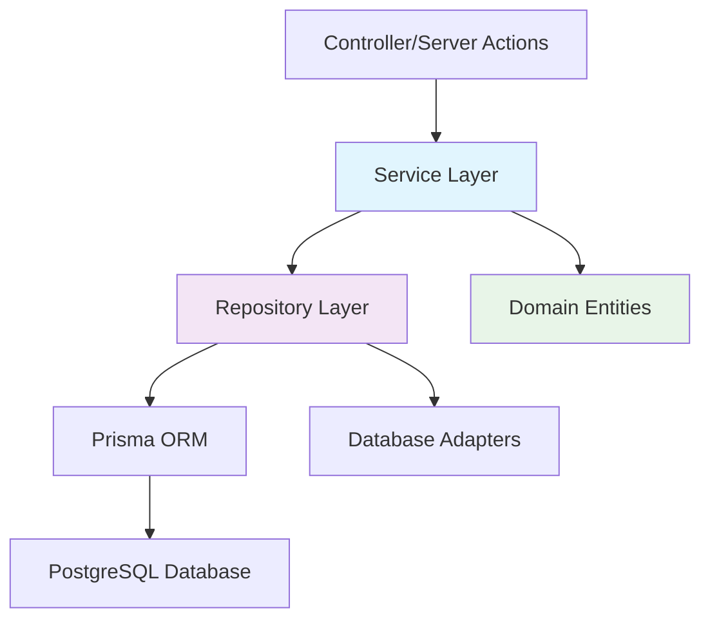

# バックエンド構造

## 概要

Biz Clone のバックエンドは、**レイヤードアーキテクチャ**に基づいて設計されており、ビジネスロジックとデータアクセスを明確に分離しています。  
**Repository パターン**と**Service 層**により、保守性と拡張性を重視した設計となっています。

## アーキテクチャパターン

### 1. 依存関係の方向



### 2. レイヤー構成

#### Service Layer (`lib/services/`)

- **責務**: ビジネスロジックの実装
- **特徴**: ドメイン特化の操作、複合処理
- **技術**: TypeScript, 依存性注入

#### Repository Layer (`lib/repositories/`)

- **責務**: データアクセスの抽象化
- **特徴**: CRUD 操作、検索、トランザクション管理
- **技術**: Prisma ORM, PostgreSQL

#### Domain Layer (`lib/types/`, `lib/schemas/`)

- **責務**: ビジネスエンティティの定義
- **特徴**: 型安全性、バリデーション
- **技術**: TypeScript, Zod

## ディレクトリ構造

```
lib/
├── repositories/              # データアクセス層
│   ├── interfaces/           # Repository インターフェース
│   │   ├── IRepository.ts    # 基底インターフェース
│   │   ├── IAccountRepository.ts
│   │   ├── IPartnerRepository.ts
│   │   ├── IJournalRepository.ts
│   │   └── IAnalysisCodeRepository.ts
│   ├── implementations/      # Repository 実装
│   │   ├── AccountRepository.ts
│   │   ├── PartnerRepository.ts
│   │   └── JournalRepository.ts
│   └── base/                # 基底クラス
│       └── BaseRepository.ts
├── services/                 # ビジネスロジック層
│   ├── interfaces/          # Service インターフェース
│   │   └── IAccountService.ts
│   ├── AccountService.ts    # 勘定科目サービス
│   ├── PartnerService.ts    # 取引先サービス
│   └── JournalService.ts    # 仕訳サービス
├── adapters/                # 外部システム接続
│   └── database/            # データベースアダプター
├── schemas/                 # バリデーションスキーマ
│   ├── common/              # 共通スキーマ
│   └── master/              # マスタ系スキーマ
├── types/                   # 型定義
│   └── domain/              # ドメインエンティティ
└── utils/                   # ユーティリティ関数
    └── validation.ts        # バリデーション共通関数
```

## Repository パターン実装

### 1. 基底インターフェース

```typescript
// lib/repositories/interfaces/IRepository.ts
export interface IRepository<T, ID> {
  create(entity: Omit<T, "id" | "createdAt" | "updatedAt">): Promise<T>;
  findById(id: ID): Promise<T | null>;
  findAll(filter?: Partial<T>): Promise<T[]>;
  update(id: ID, entity: Partial<T>): Promise<T>;
  delete(id: ID): Promise<void>;
}

export interface ISearchableRepository<T, ID> extends IRepository<T, ID> {
  search(query: string, fields: Array<keyof T>): Promise<T[]>;
  findPaginated(
    pagination: PaginationOptions,
    filter?: Partial<T>
  ): Promise<PaginatedResult<T>>;
}

export interface ITransactionalRepository<T, ID> extends IRepository<T, ID> {
  withTransaction<R>(
    callback: (repo: IRepository<T, ID>) => Promise<R>
  ): Promise<R>;
}
```

### 2. ドメイン特化インターフェース

```typescript
// lib/repositories/interfaces/IAccountRepository.ts
export interface IAccountRepository
  extends ISearchableRepository<Account, string>,
    ITransactionalRepository<Account, string> {
  // 勘定科目特有のメソッド
  findByType(accountType: Account["accountType"]): Promise<Account[]>;
  findByParent(parentAccountCode: string): Promise<Account[]>;
  findDetailAccounts(): Promise<Account[]>;
  findActiveAccounts(): Promise<Account[]>;

  // 階層構造関連
  getAccountHierarchy(): Promise<Account[]>;
  moveAccount(
    accountCode: string,
    newParentCode: string | null
  ): Promise<Account>;

  // バリデーション関連
  isValidAccountCode(accountCode: string): Promise<boolean>;
  canDeleteAccount(accountCode: string): Promise<boolean>;
}
```

### 3. Repository 実装

```typescript
// lib/repositories/implementations/AccountRepository.ts
export class AccountRepository implements IAccountRepository {
  constructor(private prisma: PrismaClient) {}

  async create(accountData: AccountCreateDto): Promise<Account> {
    return await this.prisma.account.create({
      data: accountData,
      include: {
        parentAccount: true,
        childAccounts: true,
        subAccounts: true,
      },
    });
  }

  async findById(accountCode: string): Promise<Account | null> {
    return await this.prisma.account.findUnique({
      where: { accountCode },
      include: {
        parentAccount: true,
        childAccounts: true,
        subAccounts: true,
      },
    });
  }

  async withTransaction<R>(
    callback: (repo: IAccountRepository) => Promise<R>
  ): Promise<R> {
    return await this.prisma.$transaction(async (tx) => {
      const transactionalRepo = new AccountRepository(tx as PrismaClient);
      return await callback(transactionalRepo);
    });
  }
}
```

## Service Layer 実装

### 1. Service インターフェース

```typescript
// lib/services/interfaces/IAccountService.ts
export interface IAccountService {
  // 基本CRUD操作
  getAccount(accountCode: string): Promise<Account | null>;
  getAllAccounts(options?: AccountSearchOptions): Promise<Account[]>;
  createAccount(accountData: AccountCreateDto): Promise<Account>;
  updateAccount(
    accountCode: string,
    accountData: AccountUpdateDto
  ): Promise<Account>;
  deleteAccount(accountCode: string): Promise<void>;

  // 検索機能
  searchAccounts(
    query: string,
    pagination?: PaginationOptions
  ): Promise<PaginatedResult<Account>>;

  // ビジネスロジック特化機能
  getAccountHierarchy(): Promise<AccountHierarchyNode[]>;
  moveAccountToParent(
    accountCode: string,
    newParentCode: string | null
  ): Promise<Account>;
  validateAccountCode(accountCode: string): Promise<ValidationResult>;
  canDeleteAccount(accountCode: string): Promise<CanDeleteResult>;
}
```

### 2. Service 実装

```typescript
// lib/services/AccountService.ts
export class AccountService implements IAccountService {
  constructor(private accountRepository: IAccountRepository) {}

  async createAccount(accountData: AccountCreateDto): Promise<Account> {
    // ビジネスルールの検証
    await this.validateAccountBusinessRules(accountData);

    return await this.accountRepository.create(accountData);
  }

  async updateAccount(
    accountCode: string,
    accountData: AccountUpdateDto
  ): Promise<Account> {
    // 存在確認
    const existing = await this.accountRepository.findById(accountCode);
    if (!existing) {
      throw new Error(`Account with code ${accountCode} not found`);
    }

    // ビジネスルールの検証
    if (accountData.parentAccountCode !== undefined) {
      await this.validateParentAccountChange(
        accountCode,
        accountData.parentAccountCode
      );
    }

    return await this.accountRepository.update(accountCode, accountData);
  }

  private async validateAccountBusinessRules(
    accountData: AccountCreateDto
  ): Promise<void> {
    // 勘定科目コードの形式チェック
    const codePattern = /^[A-Z0-9]{3,10}$/;
    if (!codePattern.test(accountData.accountCode)) {
      throw new Error("勘定科目コードは3-10文字の英数字で入力してください");
    }

    // 重複チェック
    const isValid = await this.accountRepository.isValidAccountCode(
      accountData.accountCode
    );
    if (!isValid) {
      throw new Error("この勘定科目コードは既に使用されています");
    }

    // 親科目の検証
    if (accountData.parentAccountCode) {
      const parent = await this.accountRepository.findById(
        accountData.parentAccountCode
      );
      if (!parent) {
        throw new Error("指定された親科目が存在しません");
      }
      if (parent.isDetail) {
        throw new Error("明細科目を親科目に設定することはできません");
      }
    }
  }
}
```

## ドメインエンティティ

### 1. エンティティ定義

```typescript
// lib/types/domain/Account.ts
export interface Account {
  accountCode: string;
  accountName: string;
  accountNameKana: string | null;
  accountType: "資産" | "負債" | "資本" | "収益" | "費用";
  parentAccountCode: string | null;
  isDetail: boolean;
  isActive: boolean;
  sortOrder: number;
  notes: string | null;
  createdAt: Date;
  updatedAt: Date;

  // Relations
  parentAccount?: Account;
  childAccounts?: Account[];
  subAccounts?: SubAccount[];
}
```

### 2. DTO（Data Transfer Object）

```typescript
// lib/types/dto/AccountDto.ts
export interface AccountCreateDto {
  accountCode: string;
  accountName: string;
  accountNameKana?: string;
  accountType: "資産" | "負債" | "資本" | "収益" | "費用";
  parentAccountCode?: string;
  isDetail: boolean;
  isActive: boolean;
  sortOrder: number;
  notes?: string;
}

export interface AccountUpdateDto {
  accountName?: string;
  accountNameKana?: string;
  accountType?: "資産" | "負債" | "資本" | "収益" | "費用";
  parentAccountCode?: string;
  isDetail?: boolean;
  isActive?: boolean;
  sortOrder?: number;
  notes?: string;
}
```

## バリデーションシステム

### 1. Zod スキーマ

```typescript
// lib/schemas/master/accountSchema.ts
import { z } from "zod";

export const accountCreateSchema = z.object({
  accountCode: z
    .string()
    .min(3, "勘定科目コードは3文字以上で入力してください")
    .max(10, "勘定科目コードは10文字以下で入力してください")
    .regex(/^[A-Z0-9]+$/, "勘定科目コードは英数字で入力してください"),

  accountName: z
    .string()
    .min(1, "勘定科目名は必須です")
    .max(100, "勘定科目名は100文字以下で入力してください"),

  accountType: z.enum(["資産", "負債", "資本", "収益", "費用"]),

  parentAccountCode: z
    .string()
    .optional()
    .refine(async (value) => {
      if (!value) return true;
      // 親科目の存在チェック
      return await validateParentAccountExists(value);
    }, "指定された親科目が存在しません"),

  isDetail: z.boolean(),
  isActive: z.boolean().default(true),
  sortOrder: z.number().int().min(0),
  notes: z.string().optional(),
});
```

### 2. バリデーション関数

```typescript
// lib/utils/validation.ts
export async function validateParentAccountExists(
  parentCode: string
): Promise<boolean> {
  const accountRepository = new AccountRepository(prisma);
  const parent = await accountRepository.findById(parentCode);
  return parent !== null && !parent.isDetail;
}

export function validateAccountCodeFormat(code: string): boolean {
  return /^[A-Z0-9]{3,10}$/.test(code);
}
```

## トランザクション管理

### 1. Repository レベル

```typescript
// 複数テーブルの更新をトランザクションで実行
async createAccountWithSubAccounts(data: CreateAccountWithSubAccountsDto): Promise<Account> {
  return await this.accountRepository.withTransaction(async (repo) => {
    // 勘定科目作成
    const account = await repo.create(data.account);

    // 補助科目作成
    if (data.subAccounts && data.subAccounts.length > 0) {
      for (const subAccountData of data.subAccounts) {
        await this.subAccountRepository.create({
          ...subAccountData,
          accountCode: account.accountCode,
        });
      }
    }

    return account;
  });
}
```

### 2. Service レベル

```typescript
// 複数のRepositoryにまたがるトランザクション
async transferJournalEntry(transferData: JournalTransferDto): Promise<void> {
  await this.prisma.$transaction(async (tx) => {
    const journalRepo = new JournalRepository(tx as PrismaClient);
    const accountRepo = new AccountRepository(tx as PrismaClient);

    // 仕訳作成
    await journalRepo.create(transferData.journalEntry);

    // 残高更新
    await accountRepo.updateBalance(transferData.accountCode, transferData.amount);
  });
}
```

## エラーハンドリング

### 1. カスタムエラー

```typescript
// lib/errors/BusinessError.ts
export class BusinessError extends Error {
  constructor(message: string, public code: string, public details?: any) {
    super(message);
    this.name = "BusinessError";
  }
}

export class ValidationError extends BusinessError {
  constructor(message: string, public field?: string, details?: any) {
    super(message, "VALIDATION_ERROR", details);
    this.name = "ValidationError";
  }
}
```

### 2. エラーハンドリング実装

```typescript
// Service層でのエラーハンドリング
async createAccount(accountData: AccountCreateDto): Promise<Account> {
  try {
    await this.validateAccountBusinessRules(accountData);
    return await this.accountRepository.create(accountData);
  } catch (error) {
    if (error instanceof ValidationError) {
      throw error; // そのまま上位に伝播
    }

    // 予期しないエラーをログ出力
    console.error('Unexpected error in createAccount:', error);
    throw new BusinessError('勘定科目の作成に失敗しました', 'ACCOUNT_CREATE_FAILED');
  }
}
```

## パフォーマンス最適化

### 1. N+1 問題の回避

```typescript
// include を使用した効率的なデータ取得
async getAccountWithRelations(accountCode: string): Promise<Account | null> {
  return await this.prisma.account.findUnique({
    where: { accountCode },
    include: {
      parentAccount: true,
      childAccounts: {
        include: {
          subAccounts: true,
        },
      },
      subAccounts: true,
      _count: {
        select: {
          journalDetails: true,
        },
      },
    },
  });
}
```

### 2. バッチ処理

```typescript
// 一括作成処理
async bulkCreateAccounts(accounts: AccountCreateDto[]): Promise<Account[]> {
  // バリデーション
  for (const account of accounts) {
    await this.validateAccountBusinessRules(account);
  }

  // バッチ実行
  return await this.prisma.$transaction(
    accounts.map(account =>
      this.prisma.account.create({ data: account })
    )
  );
}
```

## テスト可能性

### 1. 依存性注入

```typescript
// Service のテスタブルな構成
export class AccountService {
  constructor(
    private accountRepository: IAccountRepository,
    private logger?: ILogger
  ) {}
}

// テスト時のモック使用
const mockAccountRepository = {
  findById: jest.fn(),
  create: jest.fn(),
  // ...
} as jest.Mocked<IAccountRepository>;

const service = new AccountService(mockAccountRepository);
```

### 2. インターフェースベース設計

```typescript
// インターフェースによる抽象化
interface IAccountService {
  createAccount(data: AccountCreateDto): Promise<Account>;
}

// 実装クラス
export class AccountService implements IAccountService {
  // 実装
}

// テスト用モック
export class MockAccountService implements IAccountService {
  // テスト用実装
}
```
