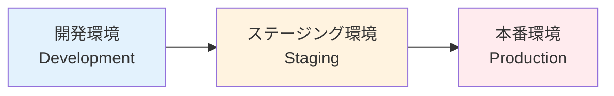
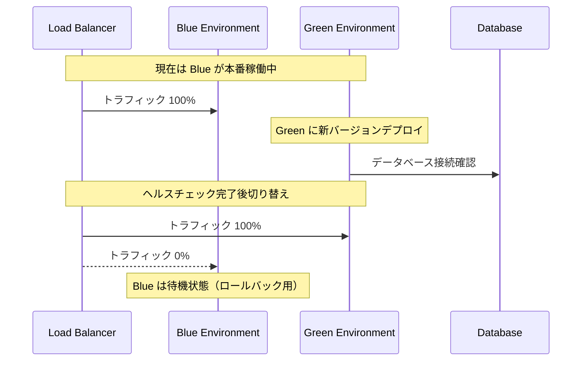
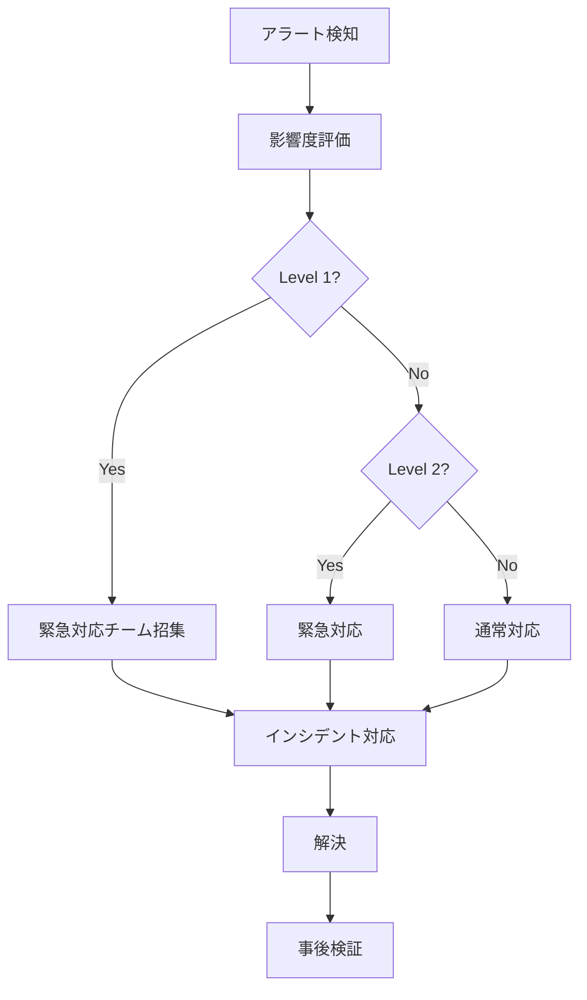

# 運用・保守

## 概要

Biz Clone の運用・保守は、**安定性**、**セキュリティ**、**パフォーマンス**を重視した体制で実施されます。  
モニタリング、ログ管理、バックアップ戦略により、24 時間 365 日の安定稼働を実現します。

## デプロイメント戦略

### 1. 環境構成



#### 開発環境（Development）

- **目的**: 機能開発・デバッグ
- **デプロイ**: 自動（main ブランチプッシュ時）
- **データ**: ダミーデータ
- **URL**: `https://dev.biz-clone.com`

#### ステージング環境（Staging）

- **目的**: 本番前最終確認
- **デプロイ**: 手動承認後自動
- **データ**: 本番類似データ
- **URL**: `https://staging.biz-clone.com`

#### 本番環境（Production）

- **目的**: エンドユーザー向けサービス
- **デプロイ**: 手動承認後自動
- **データ**: 本番データ
- **URL**: `https://biz-clone.com`

### 2. デプロイメントパイプライン

```yaml
# .github/workflows/deploy.yml
name: Deploy

on:
  push:
    branches: [main]
  release:
    types: [published]

jobs:
  deploy-dev:
    if: github.ref == 'refs/heads/main'
    runs-on: ubuntu-latest
    environment: development

    steps:
      - name: Deploy to Development
        uses: vercel/action@v1
        with:
          vercel-token: ${{ secrets.VERCEL_TOKEN }}
          vercel-org-id: ${{ secrets.ORG_ID }}
          vercel-project-id: ${{ secrets.PROJECT_ID }}
          working-directory: ./

  deploy-staging:
    if: github.event_name == 'release'
    runs-on: ubuntu-latest
    environment: staging

    steps:
      - name: Deploy to Staging
        uses: vercel/action@v1
        with:
          vercel-token: ${{ secrets.VERCEL_TOKEN }}
          vercel-args: "--prod"

  deploy-production:
    if: github.event_name == 'release'
    runs-on: ubuntu-latest
    environment: production
    needs: deploy-staging

    steps:
      - name: Deploy to Production
        uses: vercel/action@v1
        with:
          vercel-token: ${{ secrets.VERCEL_TOKEN }}
          vercel-args: "--prod"
```

### 3. ブルーグリーンデプロイメント



## モニタリング・監視

### 1. システム監視

#### Vercel Analytics

```typescript
// next.config.ts
const nextConfig = {
  experimental: {
    instrumentationHook: true,
  },
  analytics: {
    provider: "vercel",
  },
};

export default nextConfig;
```

#### カスタムメトリクス

```typescript
// lib/monitoring/metrics.ts
export class MetricsCollector {
  static async recordApiCall(
    endpoint: string,
    duration: number,
    status: number
  ) {
    await fetch("/api/metrics", {
      method: "POST",
      headers: { "Content-Type": "application/json" },
      body: JSON.stringify({
        type: "api_call",
        endpoint,
        duration,
        status,
        timestamp: Date.now(),
      }),
    });
  }

  static async recordDatabaseQuery(query: string, duration: number) {
    await fetch("/api/metrics", {
      method: "POST",
      headers: { "Content-Type": "application/json" },
      body: JSON.stringify({
        type: "database_query",
        query: query.substring(0, 100), // 個人情報除去
        duration,
        timestamp: Date.now(),
      }),
    });
  }
}
```

### 2. アプリケーション監視

#### エラー追跡

```typescript
// lib/monitoring/error-tracking.ts
export class ErrorTracker {
  static captureException(error: Error, context?: Record<string, any>) {
    const errorData = {
      message: error.message,
      stack: error.stack,
      context,
      timestamp: Date.now(),
      url: typeof window !== "undefined" ? window.location.href : undefined,
      userAgent:
        typeof window !== "undefined" ? navigator.userAgent : undefined,
    };

    // エラーログ送信
    fetch("/api/errors", {
      method: "POST",
      headers: { "Content-Type": "application/json" },
      body: JSON.stringify(errorData),
    });
  }

  static captureMessage(message: string, level: "info" | "warning" | "error") {
    fetch("/api/logs", {
      method: "POST",
      headers: { "Content-Type": "application/json" },
      body: JSON.stringify({
        message,
        level,
        timestamp: Date.now(),
      }),
    });
  }
}
```

#### パフォーマンス監視

```typescript
// lib/monitoring/performance.ts
export class PerformanceMonitor {
  static measurePageLoad() {
    if (typeof window === "undefined") return;

    window.addEventListener("load", () => {
      const navigation = performance.getEntriesByType(
        "navigation"
      )[0] as PerformanceNavigationTiming;

      const metrics = {
        dns: navigation.domainLookupEnd - navigation.domainLookupStart,
        connect: navigation.connectEnd - navigation.connectStart,
        request: navigation.responseStart - navigation.requestStart,
        response: navigation.responseEnd - navigation.responseStart,
        dom: navigation.domContentLoadedEventEnd - navigation.responseEnd,
        load: navigation.loadEventEnd - navigation.loadEventStart,
        total: navigation.loadEventEnd - navigation.navigationStart,
      };

      fetch("/api/performance", {
        method: "POST",
        headers: { "Content-Type": "application/json" },
        body: JSON.stringify(metrics),
      });
    });
  }

  static measureApiResponse(url: string, startTime: number) {
    const duration = performance.now() - startTime;

    if (duration > 1000) {
      // 1秒以上の場合は警告
      ErrorTracker.captureMessage(
        `Slow API response: ${url} took ${duration}ms`,
        "warning"
      );
    }

    return duration;
  }
}
```

### 3. データベース監視

#### Prisma 監視

```typescript
// lib/monitoring/prisma-middleware.ts
import { PrismaClient } from "@prisma/client";

export function createPrismaClient() {
  const prisma = new PrismaClient({
    log: [
      { level: "query", emit: "event" },
      { level: "error", emit: "event" },
      { level: "warn", emit: "event" },
    ],
  });

  // クエリ実行時間監視
  prisma.$on("query", (e) => {
    if (e.duration > 1000) {
      // 1秒以上の場合
      ErrorTracker.captureMessage(
        `Slow database query: ${e.query} took ${e.duration}ms`,
        "warning"
      );
    }
  });

  // エラー監視
  prisma.$on("error", (e) => {
    ErrorTracker.captureException(new Error(e.message), {
      target: e.target,
      timestamp: e.timestamp,
    });
  });

  return prisma;
}
```

## ログ管理

### 1. ログレベル

```typescript
// lib/logging/logger.ts
export enum LogLevel {
  DEBUG = 0,
  INFO = 1,
  WARN = 2,
  ERROR = 3,
}

export class Logger {
  private static instance: Logger;
  private logLevel: LogLevel;

  private constructor() {
    this.logLevel = this.getLogLevel();
  }

  static getInstance(): Logger {
    if (!Logger.instance) {
      Logger.instance = new Logger();
    }
    return Logger.instance;
  }

  private getLogLevel(): LogLevel {
    const level = process.env.LOG_LEVEL || "info";
    switch (level.toLowerCase()) {
      case "debug":
        return LogLevel.DEBUG;
      case "info":
        return LogLevel.INFO;
      case "warn":
        return LogLevel.WARN;
      case "error":
        return LogLevel.ERROR;
      default:
        return LogLevel.INFO;
    }
  }

  debug(message: string, meta?: any) {
    if (this.logLevel <= LogLevel.DEBUG) {
      this.log("DEBUG", message, meta);
    }
  }

  info(message: string, meta?: any) {
    if (this.logLevel <= LogLevel.INFO) {
      this.log("INFO", message, meta);
    }
  }

  warn(message: string, meta?: any) {
    if (this.logLevel <= LogLevel.WARN) {
      this.log("WARN", message, meta);
    }
  }

  error(message: string, error?: Error, meta?: any) {
    if (this.logLevel <= LogLevel.ERROR) {
      this.log("ERROR", message, {
        error: error?.message,
        stack: error?.stack,
        ...meta,
      });
    }
  }

  private log(level: string, message: string, meta?: any) {
    const logEntry = {
      timestamp: new Date().toISOString(),
      level,
      message,
      meta,
      pid: process.pid,
      hostname: process.env.VERCEL_REGION || "local",
    };

    console.log(JSON.stringify(logEntry));
  }
}
```

### 2. 構造化ログ

```typescript
// lib/logging/structured-logger.ts
export interface LogContext {
  userId?: string;
  sessionId?: string;
  requestId?: string;
  operation?: string;
  duration?: number;
}

export class StructuredLogger {
  static logApiRequest(req: NextRequest, res: NextResponse, duration: number) {
    const logger = Logger.getInstance();

    logger.info("API Request", {
      method: req.method,
      url: req.url,
      status: res.status,
      duration,
      userAgent: req.headers.get("user-agent"),
      ip: req.headers.get("x-forwarded-for") || "unknown",
    });
  }

  static logDatabaseOperation(
    operation: string,
    table: string,
    duration: number,
    context?: LogContext
  ) {
    const logger = Logger.getInstance();

    logger.info("Database Operation", {
      operation,
      table,
      duration,
      ...context,
    });
  }

  static logBusinessEvent(event: string, context?: LogContext) {
    const logger = Logger.getInstance();

    logger.info("Business Event", {
      event,
      ...context,
    });
  }
}
```

### 3. ログ集約・分析

#### Vercel Log Drains 設定

```bash
# Vercel CLIでログ転送設定
vercel logs --output json | jq '.message' | grep ERROR
```

## バックアップ戦略

### 1. データベースバックアップ

#### 自動バックアップ（Supabase）

```sql
-- 日次バックアップ（Supabase自動実行）
-- Point-in-Time Recovery: 7日間
-- フルバックアップ: 毎日午前2時（JST）
```

#### 手動バックアップスクリプト

```bash
#!/bin/bash
# scripts/backup-database.sh

DATE=$(date +%Y%m%d_%H%M%S)
BACKUP_FILE="backup_${DATE}.sql"

# データベースダンプ
pg_dump $DATABASE_URL > "/backups/${BACKUP_FILE}"

# 圧縮
gzip "/backups/${BACKUP_FILE}"

# S3アップロード（オプション）
aws s3 cp "/backups/${BACKUP_FILE}.gz" "s3://biz-clone-backups/"

# ローカルファイル削除（7日以上前）
find /backups -name "backup_*.sql.gz" -mtime +7 -delete

echo "Backup completed: ${BACKUP_FILE}.gz"
```

#### バックアップ検証

```bash
#!/bin/bash
# scripts/verify-backup.sh

LATEST_BACKUP=$(ls -t /backups/backup_*.sql.gz | head -n1)

# テスト環境にリストア
createdb test_restore
gunzip -c "$LATEST_BACKUP" | psql test_restore

# データ整合性チェック
psql test_restore -c "SELECT COUNT(*) FROM account;"
psql test_restore -c "SELECT COUNT(*) FROM journal_header;"

# テストデータベース削除
dropdb test_restore

echo "Backup verification completed for: $LATEST_BACKUP"
```

### 2. アプリケーションバックアップ

#### 設定ファイルバックアップ

```typescript
// scripts/backup-config.ts
import fs from "fs";
import path from "path";

const configFiles = [
  ".env.production",
  "next.config.ts",
  "package.json",
  "package-lock.json",
  "prisma/schema.prisma",
];

export function backupConfigFiles() {
  const backupDir = path.join(process.cwd(), "backups", "config");

  if (!fs.existsSync(backupDir)) {
    fs.mkdirSync(backupDir, { recursive: true });
  }

  configFiles.forEach((file) => {
    if (fs.existsSync(file)) {
      const fileName = path.basename(file);
      const timestamp = new Date().toISOString().replace(/:/g, "-");
      const backupPath = path.join(backupDir, `${fileName}.${timestamp}`);

      fs.copyFileSync(file, backupPath);
      console.log(`Backed up: ${file} -> ${backupPath}`);
    }
  });
}
```

## セキュリティ

### 1. セキュリティ監視

#### 不正アクセス検知

```typescript
// lib/security/intrusion-detection.ts
export class IntrusionDetector {
  private static failedAttempts = new Map<string, number>();
  private static blockedIPs = new Set<string>();

  static checkRateLimit(ip: string, limit: number = 100): boolean {
    const attempts = this.failedAttempts.get(ip) || 0;

    if (attempts >= limit) {
      this.blockedIPs.add(ip);
      ErrorTracker.captureMessage(
        `IP blocked due to rate limit: ${ip}`,
        "warning"
      );
      return false;
    }

    return true;
  }

  static recordFailedAttempt(ip: string) {
    const attempts = this.failedAttempts.get(ip) || 0;
    this.failedAttempts.set(ip, attempts + 1);

    if (attempts > 10) {
      ErrorTracker.captureMessage(
        `Suspicious activity detected from IP: ${ip}`,
        "warning"
      );
    }
  }

  static isBlocked(ip: string): boolean {
    return this.blockedIPs.has(ip);
  }
}
```

#### SQL インジェクション対策

```typescript
// lib/security/sql-injection-prevention.ts
export function sanitizeInput(input: string): string {
  // Prismaが自動でエスケープするが、追加の安全策
  return input
    .replace(/'/g, "''")
    .replace(/;/g, "")
    .replace(/--/g, "")
    .replace(/\/\*/g, "")
    .replace(/\*\//g, "");
}

export function validateAccountCode(code: string): boolean {
  // 勘定科目コードの形式チェック
  const pattern = /^[A-Z0-9]{3,10}$/;
  return pattern.test(code);
}
```

### 2. データ暗号化

#### 機密データ暗号化

```typescript
// lib/security/encryption.ts
import crypto from "crypto";

export class DataEncryption {
  private static readonly algorithm = "aes-256-gcm";
  private static readonly keyLength = 32;

  static encrypt(text: string, key: string): string {
    const iv = crypto.randomBytes(16);
    const cipher = crypto.createCipher(this.algorithm, key);

    let encrypted = cipher.update(text, "utf8", "hex");
    encrypted += cipher.final("hex");

    return iv.toString("hex") + ":" + encrypted;
  }

  static decrypt(encryptedText: string, key: string): string {
    const [ivHex, encrypted] = encryptedText.split(":");
    const iv = Buffer.from(ivHex, "hex");
    const decipher = crypto.createDecipher(this.algorithm, key);

    let decrypted = decipher.update(encrypted, "hex", "utf8");
    decrypted += decipher.final("utf8");

    return decrypted;
  }
}
```

### 3. 監査ログ

#### 操作履歴記録

```typescript
// lib/audit/audit-logger.ts
export interface AuditLog {
  userId: string;
  action: string;
  resource: string;
  resourceId: string;
  oldValue?: any;
  newValue?: any;
  timestamp: Date;
  ip: string;
  userAgent: string;
}

export class AuditLogger {
  static async log(auditData: Omit<AuditLog, "timestamp">) {
    const log: AuditLog = {
      ...auditData,
      timestamp: new Date(),
    };

    await prisma.auditLog.create({
      data: log,
    });

    // 重要な操作の場合は即座に通知
    if (this.isCriticalOperation(auditData.action)) {
      await this.sendAlert(log);
    }
  }

  private static isCriticalOperation(action: string): boolean {
    const criticalActions = [
      "DELETE_ACCOUNT",
      "MODIFY_JOURNAL",
      "ADMIN_LOGIN",
      "PERMISSION_CHANGE",
    ];
    return criticalActions.includes(action);
  }

  private static async sendAlert(log: AuditLog) {
    // アラート通知実装
    ErrorTracker.captureMessage(
      `Critical operation performed: ${log.action} by user ${log.userId}`,
      "warning"
    );
  }
}
```

## 障害対応

### 1. インシデント管理

#### 障害レベル定義

- **Level 1 (Critical)**: サービス完全停止
- **Level 2 (High)**: 主要機能に重大な影響
- **Level 3 (Medium)**: 一部機能に影響
- **Level 4 (Low)**: 軽微な不具合

#### 対応フロー



### 2. 障害復旧手順

#### ロールバック手順

```bash
#!/bin/bash
# scripts/rollback.sh

PREVIOUS_VERSION=$1

if [ -z "$PREVIOUS_VERSION" ]; then
  echo "Usage: ./rollback.sh <previous-version>"
  exit 1
fi

# Vercelデプロイメントのロールバック
vercel rollback $PREVIOUS_VERSION --token=$VERCEL_TOKEN

# データベースマイグレーションのロールバック（必要な場合）
npx prisma migrate rollback --to=$PREVIOUS_VERSION

echo "Rollback completed to version: $PREVIOUS_VERSION"
```

#### ヘルスチェック

```typescript
// app/api/health/route.ts
export async function GET() {
  const healthChecks = [
    checkDatabase(),
    checkExternalServices(),
    checkDiskSpace(),
    checkMemoryUsage(),
  ];

  const results = await Promise.allSettled(healthChecks);

  const status = results.every((result) => result.status === "fulfilled")
    ? "healthy"
    : "unhealthy";

  return NextResponse.json(
    {
      status,
      timestamp: new Date().toISOString(),
      checks: results.map((result, index) => ({
        name: ["database", "external_services", "disk_space", "memory"][index],
        status: result.status === "fulfilled" ? "pass" : "fail",
        message: result.status === "rejected" ? result.reason : "OK",
      })),
    },
    {
      status: status === "healthy" ? 200 : 503,
    }
  );
}

async function checkDatabase() {
  await prisma.$queryRaw`SELECT 1`;
}

async function checkExternalServices() {
  // 外部サービスの疎通確認
  const response = await fetch("https://api.external-service.com/health");
  if (!response.ok) {
    throw new Error("External service unavailable");
  }
}

async function checkDiskSpace() {
  // ディスク容量チェック（必要に応じて実装）
}

async function checkMemoryUsage() {
  const used = process.memoryUsage();
  if (used.heapUsed > 500 * 1024 * 1024) {
    // 500MB
    throw new Error("High memory usage detected");
  }
}
```

## 運用自動化

### 1. 定期メンテナンス

#### Cron Jobs

```yaml
# .github/workflows/maintenance.yml
name: Maintenance

on:
  schedule:
    # 毎日午前2時（JST）
    - cron: "0 17 * * *"
    # 毎週日曜日午前3時（JST）
    - cron: "0 18 * * 0"

jobs:
  daily-maintenance:
    if: github.event.schedule == '0 17 * * *'
    runs-on: ubuntu-latest
    steps:
      - name: Database optimization
        run: |
          npx prisma db execute --sql "VACUUM ANALYZE;"
          npx prisma db execute --sql "REINDEX DATABASE;"

      - name: Log rotation
        run: |
          ./scripts/rotate-logs.sh

  weekly-maintenance:
    if: github.event.schedule == '0 18 * * 0'
    runs-on: ubuntu-latest
    steps:
      - name: Full backup
        run: |
          ./scripts/backup-database.sh
          ./scripts/backup-config.sh

      - name: Security scan
        run: |
          npm audit
          ./scripts/security-scan.sh
```

### 2. アラート設定

#### Slack 通知

```typescript
// lib/notifications/slack.ts
export class SlackNotifier {
  private static webhookUrl = process.env.SLACK_WEBHOOK_URL;

  static async sendAlert(message: string, level: "info" | "warning" | "error") {
    if (!this.webhookUrl) return;

    const color = {
      info: "#36a64f",
      warning: "#ff9900",
      error: "#ff0000",
    }[level];

    const payload = {
      attachments: [
        {
          color,
          title: `Biz Clone Alert - ${level.toUpperCase()}`,
          text: message,
          ts: Math.floor(Date.now() / 1000),
        },
      ],
    };

    await fetch(this.webhookUrl, {
      method: "POST",
      headers: { "Content-Type": "application/json" },
      body: JSON.stringify(payload),
    });
  }
}
```

## 運用チェックリスト

### 日次チェック

- [ ] システム稼働状況確認
- [ ] エラーログ確認
- [ ] パフォーマンスメトリクス確認
- [ ] バックアップ完了確認
- [ ] セキュリティアラート確認

### 週次チェック

- [ ] 脆弱性スキャン実行
- [ ] フルバックアップ確認
- [ ] パフォーマンス傾向分析
- [ ] リソース使用量確認
- [ ] 運用ドキュメント更新

### 月次チェック

- [ ] セキュリティパッチ適用
- [ ] 依存関係更新
- [ ] インシデント振り返り
- [ ] 容量計画見直し
- [ ] 災害復旧テスト実施
