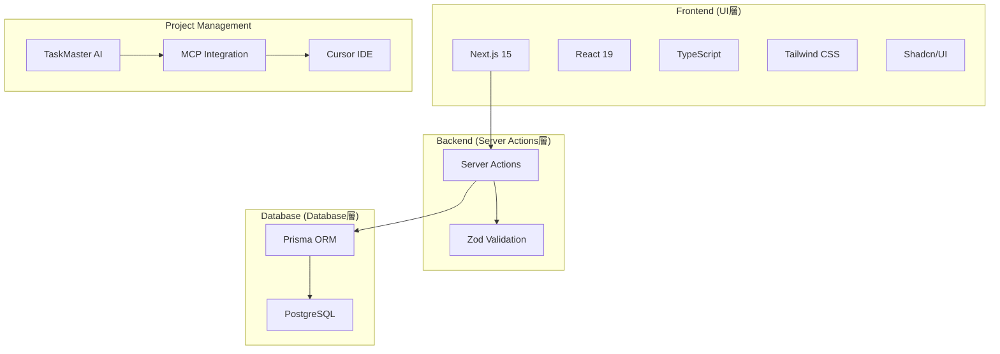

# Biz Clone 設計ドキュメント

## 概要

Biz Clone は、日本の中小企業向けに開発された現代的な会計システムです。  
複式簿記に基づく正確な会計処理と、使いやすいユーザーインターフェースを提供します。

**このプロジェクトは[TaskMaster](https://github.com/taskmaster-ai/taskmaster)を使用してタスク管理を行っています。**

## TaskMaster 開発ワークフロー

### 1. 基本コマンド

**Cursor/MCP 統合環境での推奨使用方法:**

- TaskMaster の MCP サーバーを通じて、AI 支援による効率的な開発を実現
- 詳細な使用方法は `.cursor/rules/taskmaster.mdc` を参照

**CLI コマンド（フォールバック用）:**

```bash
# タスク一覧表示
task-master list

# 次のタスク確認
task-master next

# タスクの詳細表示
task-master show <task-id>

# タスクステータス更新
task-master set-status --id=<task-id> --status=done

# 複雑なタスクの分解
task-master expand --id=<task-id> --research --force
```

### 2. 開発セッション開始時の標準手順

1. **プロジェクト状況確認**

   ```bash
   task-master list
   ```

2. **次のタスク特定**

   ```bash
   task-master next
   ```

3. **タスクの詳細確認**

   ```bash
   task-master show <task-id>
   ```

4. **必要に応じてタスク分解**
   ```bash
   task-master expand --id=<task-id> --research --force
   ```

### 3. タスク管理の原則

- **依存関係の遵守**: 前提タスクが完了してから次のタスクに着手
- **適切な分解**: 複雑なタスクは実装可能な単位まで分解
- **進捗の記録**: サブタスクに実装過程を詳細に記録
- **定期的な更新**: 実装方針変更時は関連タスクを適切に更新

## ドキュメント構成

本設計ドキュメントは、以下の構成でプロジェクトの全体像から具体的な実装詳細まで体系的に説明しています。

### 📋 [01\_プロジェクト概要.md](./01_プロジェクト概要.md)

- **内容**: プロジェクトの概要、技術スタック、主要機能
- **対象読者**: 全ステークホルダー（開発者、PM、経営陣）
- **重要度**: ⭐⭐⭐⭐⭐

プロジェクトの全体像を理解するための出発点です。ビジネス要件と技術選択の背景を説明しています。

### 🏗️ [02\_アーキテクチャ設計.md](./02_アーキテクチャ設計.md)

- **内容**: システム全体のアーキテクチャ、レイヤー構成、設計パターン
- **対象読者**: アーキテクト、リードエンジニア
- **重要度**: ⭐⭐⭐⭐⭐

システムの構造と各コンポーネント間の関係性を理解できます。新しい機能追加時の設計指針としても活用できます。

### 🗄️ [03\_データベース設計.md](./03_データベース設計.md)

- **内容**: ER 図、テーブル仕様、リレーション、インデックス戦略
- **対象読者**: バックエンドエンジニア、DBA
- **重要度**: ⭐⭐⭐⭐⭐

会計システムの核となるデータモデルを詳細に説明。複式簿記の概念をデータベース設計に落とし込んだ構造を理解できます。

### 🎨 [04\_フロントエンド構造.md](./04_フロントエンド構造.md)

- **内容**: UI コンポーネント構成、画面設計、ユーザーフロー
- **対象読者**: フロントエンドエンジニア、UI/UX デザイナー
- **重要度**: ⭐⭐⭐⭐

React/Next.js を使用したモダンなフロントエンド構成と、会計システムに特化した画面設計を説明しています。

### ⚙️ [05\_バックエンド構造.md](./05_バックエンド構造.md)

- **内容**: Service 層、Repository パターン、ビジネスロジック実装
- **対象読者**: バックエンドエンジニア
- **重要度**: ⭐⭐⭐⭐⭐

レイヤードアーキテクチャに基づくバックエンド実装の詳細。会計システム特有のビジネスルールとその実装方法を理解できます。

### 🧪 [06\_開発・テスト環境.md](./06_開発・テスト環境.md)

- **内容**: 開発環境構築、テスト戦略、CI/CD パイプライン、TaskMaster 統合
- **対象読者**: 全開発者、DevOps エンジニア
- **重要度**: ⭐⭐⭐⭐

開発効率と品質を担保するためのツール設定とプロセスを説明しています。TaskMaster を使用した効率的な開発ワークフローも含まれます。

### 🚀 [07\_運用・保守.md](./07_運用・保守.md)

- **内容**: デプロイメント、モニタリング、セキュリティ、障害対応
- **対象読者**: DevOps エンジニア、運用チーム
- **重要度**: ⭐⭐⭐⭐

本番環境での安定運用のための戦略と手順を詳細に説明しています。

### 📝 [08\_コーディング規約.md](./08_コーディング規約.md)

- **内容**: TypeScript、React、データベース関連のコーディング規約
- **対象読者**: 全開発者
- **重要度**: ⭐⭐⭐⭐

チーム全体でのコード品質維持のためのガイドライン。新メンバーのオンボーディングにも活用できます。

### 🔧 [09\_型システム統一.md](./09_型システム統一.md)

- **内容**: TypeScript 型定義の統一、型安全性の確保、型変換パターン
- **対象読者**: 全開発者
- **重要度**: ⭐⭐⭐⭐⭐

システム全体で使用する型定義の統一方針とベストプラクティス。2025 年 6 月の大型リファクタリングで確立された型システムを説明。

## 技術スタック概要



## 主要機能

### 会計マスタ管理

- **勘定科目管理**: 階層構造対応の勘定科目マスタ
- **補助科目管理**: 勘定科目の詳細分類
- **取引先管理**: 得意先・仕入先等の取引先情報
- **分析コード管理**: 部門・プロジェクト等の管理会計軸

### 仕訳管理

- **仕訳入力**: 複式簿記に基づく正確な仕訳入力
- **仕訳検索**: 条件指定による仕訳の検索・絞り込み
- **仕訳承認**: ワークフロー機能（将来実装予定）

### 帳票出力

- **総勘定元帳**: 勘定科目別の取引履歴
- **試算表**: 貸借対照表・損益計算書の基礎資料
- **補助元帳**: 補助科目別の詳細履歴

## 開発環境クイックスタート

### 1. 基本環境構築

```bash
# 1. リポジトリクローン
git clone <repository-url>
cd biz-clone

# 2. 依存関係インストール
npm install

# 3. 環境変数設定
cp .env.example .env
# .env ファイルを編集

# 4. データベース初期化
npx prisma generate
npx prisma migrate dev

# 5. 開発サーバー起動
npm run dev
```

### 2. TaskMaster 初期設定

```bash
# TaskMaster プロジェクト初期化（初回のみ）
task-master init

# PRD解析によるタスク生成（初回のみ）
task-master parse-prd --input='.taskmaster/docs/prd.txt' --research

# 現在のタスク状況確認
task-master list
```

### 3. AI モデル設定

```bash
# 対話式で AI モデルを設定
task-master models --setup

# 現在の設定確認
task-master models
```

詳細な環境構築手順は [06\_開発・テスト環境.md](./06_開発・テスト環境.md) を参照してください。

## プロジェクト構造

```
biz-clone/
├── .taskmaster/             # TaskMaster 設定・タスク管理
│   ├── config.json         # AI モデル・設定
│   ├── tasks/              # タスクファイル
│   ├── docs/               # プロジェクト設計ドキュメント
│   └── reports/            # 複雑度分析レポート等
├── app/                     # Next.js App Router (UI層)
│   ├── actions/            # Server Actions (ビジネスロジック層)
│   │   ├── accounts.ts     # 勘定科目操作
│   │   ├── partners.ts     # 取引先操作
│   │   └── analysis-codes.ts # 分析コード操作
│   ├── master/             # マスタ管理画面
│   │   ├── accounts/       # 勘定科目管理
│   │   ├── partners/       # 取引先管理
│   │   └── analysis-codes/ # 分析コード管理
│   └── siwake/             # 仕訳関連画面
├── components/             # UI コンポーネント (UI層)
│   ├── ui/                 # 基本 UI コンポーネント
│   ├── accounting/         # 会計特化コンポーネント
│   └── layout/             # レイアウトコンポーネント
├── lib/                    # ユーティリティ・データベース層
│   ├── database/           # Prismaクライアント (Database層)
│   ├── schemas/            # Zodバリデーションスキーマ
│   └── utils/              # ユーティリティ関数
├── types/                  # 統一TypeScript型定義
├── prisma/                 # データベーススキーマ・マイグレーション
└── __tests__/              # テストファイル
```

## 開発フロー

### TaskMaster 統合開発フロー

1. **セッション開始**

   - `task-master list` で現在の状況確認
   - `task-master next` で次のタスク特定

2. **タスク分析**

   - `task-master show <id>` で詳細確認
   - 必要に応じて `task-master expand --id=<id> --research --force` で分解

3. **実装**

   - サブタスクに実装過程を詳細記録
   - `task-master update-subtask --id=<subtask-id> --prompt='実装詳細...'`

4. **完了処理**
   - `task-master set-status --id=<id> --status=done`
   - 関連タスク更新時は `task-master update --from=<id> --prompt='変更内容...'`

### 従来開発フロー（参考）

1. **要件分析** → [01\_プロジェクト概要.md](./01_プロジェクト概要.md)
2. **設計** → [02\_アーキテクチャ設計.md](./02_アーキテクチャ設計.md), [03\_データベース設計.md](./03_データベース設計.md)
3. **実装** → [04\_フロントエンド構造.md](./04_フロントエンド構造.md), [05\_バックエンド構造.md](./05_バックエンド構造.md)
4. **品質保証** → [06\_開発・テスト環境.md](./06_開発・テスト環境.md), [08\_コーディング規約.md](./08_コーディング規約.md)
5. **運用** → [07\_運用・保守.md](./07_運用・保守.md)

## 貢献ガイド

### 新機能開発

1. **TaskMaster によるタスク管理**

   - 新機能要求を `task-master add-task --prompt="機能詳細" --research` でタスク化
   - 複雑度分析: `task-master analyze-complexity --research`
   - タスク分解: `task-master expand --id=<id> --research --force`

2. **設計・実装**
   - [02\_アーキテクチャ設計.md](./02_アーキテクチャ設計.md) の設計原則に従う
   - [08\_コーディング規約.md](./08_コーディング規約.md) のコーディング規約を遵守
   - [06\_開発・テスト環境.md](./06_開発・テスト環境.md) のテスト戦略に基づくテスト作成

### バグ修正

1. **TaskMaster によるバグ管理**

   - バグ報告を `task-master add-task --prompt="バグ詳細と修正方針" --priority=high` でタスク化
   - 関連タスクの依存関係設定: `task-master add-dependency --id=<new-id> --depends-on=<blocking-id>`

2. **修正プロセス**
   - [07\_運用・保守.md](./07_運用・保守.md) の障害対応フローに従う
   - 根本原因の調査と再発防止策の検討
   - 必要に応じて設計ドキュメントの更新

### ドキュメント更新

- **自動化されたタスク管理**: TaskMaster により実装とドキュメントの整合性を維持
- **継続的改善**: 新しいパターンやベストプラクティスが確立された場合は、規約に反映
- **実装優先**: 実装と乖離が生じた場合は、速やかにドキュメントを更新

## よくある質問

### Q: TaskMaster の基本的な使い方を教えてください

A: [TaskMaster 公式ドキュメント](https://github.com/taskmaster-ai/taskmaster) と `.cursor/rules/taskmaster.mdc` を参照してください。基本的なワークフローは以下の通りです：

```bash
# 1. 現在の状況確認
task-master list

# 2. 次のタスク確認
task-master next

# 3. タスク詳細表示
task-master show <task-id>

# 4. 必要に応じてタスク分解
task-master expand --id=<task-id> --research --force
```

### Q: 新しい勘定科目タイプを追加したい

A: 以下の手順で進めてください：

1. `task-master add-task --prompt="新しい勘定科目タイプ: [具体的な要件]" --research` でタスク作成
2. [03\_データベース設計.md](./03_データベース設計.md) の Account テーブル仕様を確認
3. [05\_バックエンド構造.md](./05_バックエンド構造.md) のバリデーションロジックを参照して実装

### Q: 新しい画面を追加したい

A: TaskMaster を使用した開発手順：

1. `task-master add-task --prompt="新画面追加: [画面名と要件]" --research` でタスク作成
2. 複雑度分析: `task-master analyze-complexity --research`
3. タスク分解: `task-master expand --id=<task-id> --research --force`
4. [04\_フロントエンド構造.md](./04_フロントエンド構造.md) のページ構成とコンポーネント設計パターンに従って実装

### Q: パフォーマンス問題が発生している

A: TaskMaster によるシステマティックな対応：

1. `task-master add-task --prompt="パフォーマンス問題調査・修正: [具体的な症状]" --priority=high --research` でタスク作成
2. [07\_運用・保守.md](./07_運用・保守.md) のモニタリング・パフォーマンス最適化セクションを参照
3. 実装過程をサブタスクに詳細記録

### Q: テストケースの書き方がわからない

A: [06\_開発・テスト環境.md](./06_開発・テスト環境.md) のテスト戦略と [08\_コーディング規約.md](./08_コーディング規約.md) のテスト規約を参照してください。

## ライセンス

本プロジェクトは [MIT License](../LICENSE) の下で公開されています。

## 更新履歴

| 日付       | バージョン | 内容                                                                                                       |
| ---------- | ---------- | ---------------------------------------------------------------------------------------------------------- |
| 2025-01-21 | 2.0.0      | TaskMaster 統合、AI 支援開発ワークフロー導入                                                               |
| 2025-06-12 | 1.2.0      | 型システム統一、ユニークチェック機能、ダイアログシステム統一、エラートーストシステム、消費税計算機能の実装 |
| 2025-01-09 | 1.0.0      | 初版設計ドキュメント作成                                                                                   |

---

📚 **Note**: このドキュメントは living document として、プロジェクトの進行に合わせて継続的に更新されます。TaskMaster による自動化されたタスク管理により、実装とドキュメントの整合性が保たれています。最新の情報については、各ドキュメントの更新日時を確認してください。
