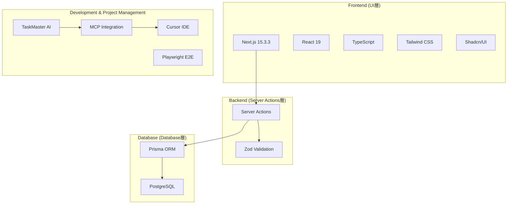

# Biz Clone 設計ドキュメント

## 概要

Biz Clone は、日本の中小企業向けに開発された現代的な会計システムです。  
複式簿記に基づく正確な会計処理と、使いやすいユーザーインターフェースを提供します。

**本プロジェクトでは [TaskMaster AI](https://github.com/taskmaster-ai/taskmaster) を核とした AI 支援開発手法を実践しており、効率的なタスク管理と継続的な品質向上を実現しています。**

## TaskMaster 開発ワークフロー

### 1. 基本コマンド（MCP 統合環境推奨）

**Cursor/MCP 統合環境での推奨使用方法:**

TaskMaster の MCP サーバーを通じて、以下のツールを Cursor IDE から直接使用できます：

- `get_tasks` - タスク一覧表示
- `next_task` - 次のタスク確認
- `get_task` - タスクの詳細表示
- `set_task_status` - タスクステータス更新
- `expand_task` - 複雑なタスクの分解
- `update_subtask` - 実装過程の記録
- `analyze_project_complexity` - プロジェクト複雑度分析

詳細な使用方法は `.cursor/rules/taskmaster.mdc` を参照してください。

**CLI コマンド（フォールバック・直接操作用）:**

```bash
# プロジェクト状況確認
task-master list

# 次のタスク確認
task-master next

# タスクの詳細表示
task-master show <task-id>

# タスクステータス更新
task-master set-status --id=<task-id> --status=done

# 複雑なタスクの分解
task-master expand --id=<task-id> --research --force

# 実装過程の記録
task-master update-subtask --id=<subtask-id> --prompt="実装詳細..."

# プロジェクト複雑度分析
task-master analyze-complexity --research --threshold=6
```

### 2. 開発セッション開始時の標準手順

1. **プロジェクト状況確認**

   - `get_tasks` ツールまたは `task-master list` で現在の状況を把握
   - 完了済み、進行中、保留中のタスクを確認

2. **次のタスク特定**

   - `next_task` ツールまたは `task-master next` で依存関係を考慮した最適なタスクを特定
   - 前提条件が満たされているタスクを優先的に選択

3. **タスクの詳細分析**

   - `get_task` ツールまたは `task-master show <task-id>` でタスクの詳細を確認
   - 実装要件、テスト戦略、依存関係を理解

4. **必要に応じてタスク分解**

   - 複雑なタスクは `expand_task` ツールまたは `task-master expand --id=<task-id> --research --force` で分解
   - 実装可能な単位まで細分化

5. **実装過程の記録**
   - `update_subtask` ツールまたは `task-master update-subtask` で実装の詳細を記録
   - 学習内容、課題、解決策を継続的に蓄積

### 3. TaskMaster 統合の利点

#### 🎯 効率的なタスク管理

- **自動タスク生成**: PRD から実装可能なタスク群を AI が自動生成
- **複雑度分析**: 各タスクの複雑度を分析し、適切な分解レベルを提案
- **依存関係管理**: タスク間の依存関係を自動で管理・可視化

#### 🔄 継続的な品質向上

- **実装記録**: 各サブタスクに実装過程を詳細に記録
- **学習の蓄積**: 成功・失敗パターンを蓄積し、今後の開発に活用
- **AI 支援レビュー**: 実装パターンの分析と改善提案

#### 🚀 スケーラブルな開発

- **一貫性の保持**: 統一された開発プロセスによる品質担保
- **知識の共有**: 実装ノウハウの組織レベルでの蓄積
- **効率的なオンボーディング**: 新メンバーへの効率的な知識伝達

### 4. タスク管理の原則

- **依存関係の遵守**: 前提タスクが完了してから次のタスクに着手
- **適切な分解**: 複雑なタスクは実装可能な単位まで分解
- **進捗の記録**: サブタスクに実装過程を詳細に記録
- **定期的な更新**: 実装方針変更時は関連タスクを適切に更新

## ドキュメント構成

本設計ドキュメントは、以下の構成でプロジェクトの全体像から具体的な実装詳細まで体系的に説明しています。

### 📋 [01\_プロジェクト概要.md](./01_プロジェクト概要.md)

- **内容**: プロジェクトの概要、技術スタック、主要機能、AI 支援開発プロセス
- **対象読者**: 全ステークホルダー（開発者、PM、経営陣）
- **重要度**: ⭐⭐⭐⭐⭐

プロジェクトの全体像を理解するための出発点です。ビジネス要件と技術選択の背景、TaskMaster 統合による開発効率化について説明しています。

### 🏗️ [02\_アーキテクチャ設計.md](./02_アーキテクチャ設計.md)

- **内容**: システム全体のアーキテクチャ、レイヤー構成、設計パターン
- **対象読者**: アーキテクト、リードエンジニア
- **重要度**: ⭐⭐⭐⭐⭐

システムの構造と各コンポーネント間の関係性を理解できます。新しい機能追加時の設計指針としても活用できます。

### 🗄️ [03\_データベース設計.md](./03_データベース設計.md)

- **内容**: ER 図、テーブル仕様、リレーション、インデックス戦略
- **対象読者**: バックエンドエンジニア、DBA
- **重要度**: ⭐⭐⭐⭐⭐

会計システムの核となるデータモデルを詳細に説明。複式簿記の概念をデータベース設計に落とし込んだ構造を理解できます。

### 🎨 [04\_フロントエンド構造.md](./04_フロントエンド構造.md)

- **内容**: UI コンポーネント構成、画面設計、ユーザーフロー
- **対象読者**: フロントエンドエンジニア、UI/UX デザイナー
- **重要度**: ⭐⭐⭐⭐

Next.js 15 と React 19 を使用したモダンなフロントエンド構成と、会計システムに特化した画面設計を説明しています。

### ⚙️ [05\_バックエンド構造.md](./05_バックエンド構造.md)

- **内容**: Server Actions、Repository パターン、ビジネスロジック実装
- **対象読者**: バックエンドエンジニア
- **重要度**: ⭐⭐⭐⭐⭐

Server Actions を使用した直接的なデータフローと、会計システム特有のビジネスルールとその実装方法を理解できます。

### 🧪 [06\_開発・テスト環境.md](./06_開発・テスト環境.md)

- **内容**: 開発環境構築、テスト戦略、CI/CD パイプライン、TaskMaster 統合
- **対象読者**: 全開発者、DevOps エンジニア
- **重要度**: ⭐⭐⭐⭐

開発効率と品質を担保するためのツール設定とプロセスを説明しています。TaskMaster を使用した効率的な開発ワークフローも含まれます。

### 🚀 [07\_運用・保守.md](./07_運用・保守.md)

- **内容**: デプロイメント、モニタリング、セキュリティ、障害対応
- **対象読者**: DevOps エンジニア、運用チーム
- **重要度**: ⭐⭐⭐⭐

本番環境での安定運用のための戦略と手順を詳細に説明しています。

### 📝 [08\_コーディング規約.md](./08_コーディング規約.md)

- **内容**: TypeScript、React、データベース関連のコーディング規約
- **対象読者**: 全開発者
- **重要度**: ⭐⭐⭐⭐

チーム全体でのコード品質維持のためのガイドライン。新メンバーのオンボーディングにも活用できます。

### 🔧 [09\_型システム統一.md](./09_型システム統一.md)

- **内容**: TypeScript 型定義の統一、型安全性の確保、型変換パターン
- **対象読者**: 全開発者
- **重要度**: ⭐⭐⭐⭐⭐

システム全体で使用する型定義の統一方針とベストプラクティス。Prisma を基盤とした型システムの統一を説明。

## 技術スタック概要



## 主要機能

### 会計マスタ管理

- **勘定科目管理**: 階層構造対応の勘定科目マスタ
- **補助科目管理**: 勘定科目の詳細分類
- **取引先管理**: 得意先・仕入先等の取引先情報
- **分析コード管理**: 部門・プロジェクト等の管理会計軸

### 仕訳管理

- **仕訳入力**: 複式簿記に基づく正確な仕訳入力
- **仕訳検索**: 条件指定による仕訳の検索・絞り込み
- **仕訳承認**: ワークフロー機能（将来実装予定）

### 帳票出力

- **総勘定元帳**: 勘定科目別の取引履歴
- **試算表**: 貸借対照表・損益計算書の基礎資料

## プロジェクト構成

```
.
├── .cursor/                 # Cursor IDE設定
│   ├── rules/              # 開発ルール・規約
│   └── mcp.json            # MCP設定
├── .taskmaster/            # TaskMaster設定・データ
│   ├── config.json         # AI設定・プロジェクト設定
│   ├── docs/               # プロジェクトドキュメント
│   ├── tasks/              # タスクデータ
│   ├── reports/            # 分析レポート
│   └── templates/          # テンプレート
├── app/                    # Next.js App Router
│   ├── (dashboard)/        # ダッシュボード関連
│   ├── siwake/            # 仕訳機能
│   ├── master/            # マスタ管理
│   └── components/        # 共通コンポーネント
├── lib/                   # 共通ライブラリ
│   ├── actions/           # Server Actions
│   ├── schemas/           # Zod schemas
│   ├── types/             # TypeScript型定義
│   └── utils/             # ユーティリティ
├── prisma/                # データベース
│   ├── schema.prisma      # Prismaスキーマ
│   └── migrations/        # マイグレーション
└── tests/                 # テストファイル
    ├── e2e/               # E2Eテスト
    └── unit/              # 単体テスト
```

## 開発フロー

### TaskMaster 統合開発フロー（推奨）

1. **プロジェクト初期化**

   ```bash
   task-master init --name="Biz Clone" --description="会計システム"
   ```

2. **タスク生成**

   ```bash
   task-master parse-prd --input='.taskmaster/docs/prd.txt' --research
   ```

3. **開発サイクル**

   - タスク確認: `task-master next`
   - 実装: コード作成 + 実装記録
   - 完了: `task-master set-status --id=<id> --status=done`

4. **品質管理**
   - 複雑度分析: `task-master analyze-complexity --research`
   - テスト実行: `npm run test`
   - 型チェック: `npm run type-check`

### 従来の開発フロー（フォールバック）

1. **環境セットアップ**

   ```bash
   npm install
   npx prisma migrate dev
   ```

2. **開発サーバー起動**

   ```bash
   npm run dev
   ```

3. **機能開発**
   - 要件定義 → 設計 → 実装 → テスト → レビュー

## セットアップ手順

### 1. 基本環境構築

```bash
# リポジトリクローン
git clone <repository-url>
cd biz-clone

# 依存関係インストール
npm install

# 環境変数設定
cp .env.example .env
# .env ファイルを編集
```

### 2. TaskMaster 初期化

```bash
# TaskMasterインストール（グローバル）
npm install -g task-master-ai

# プロジェクト初期化
task-master init --name="Biz Clone" --description="会計システム"

# AI設定
task-master models --setup

# タスク生成
task-master parse-prd --input='.taskmaster/docs/prd.txt' --research
```

### 3. データベースセットアップ

```bash
# Prismaクライアント生成
npx prisma generate

# データベースマイグレーション
npx prisma migrate dev

# 開発サーバー起動
npm run dev
```

## FAQ

### Q: TaskMaster の利用に API キーは必要ですか？

A: はい。使用する AI プロバイダーの API キーが必要です：

- **Anthropic**: Claude 3.5 Sonnet（メイン）
- **Perplexity**: Sonar Pro（リサーチ）
- **Google**: Gemini（高速処理）

詳細は `.env.example` を参照してください。

### Q: Cursor IDE なしでも開発できますか？

A: はい。TaskMaster CLI を使用することで、VS Code など他のエディターでも開発可能です。ただし、MCP 統合による効率化の恩恵は受けられません。

### Q: 既存のタスクを修正したい場合は？

A: 以下の方法で修正できます：

- `task-master update-task --id=<id> --prompt="修正内容"`
- `task-master expand --id=<id> --force` （サブタスクの再生成）
- 直接 `.taskmaster/tasks/tasks.json` を編集（非推奨）

### Q: 複雑度分析の閾値はどう設定すべきですか？

A: 一般的に：

- **閾値 6-7**: 中程度の複雑度（通常の分解推奨）
- **閾値 8-9**: 高複雑度（必須分解）
- **閾値 10**: 非常に高い複雑度（詳細な分解が必要）

### Q: TaskMaster の学習データはどこに保存されますか？

A: 以下の場所に保存されます：

- **タスクデータ**: `.taskmaster/tasks/`
- **分析レポート**: `.taskmaster/reports/`
- **実装記録**: 各サブタスクの `details` フィールド

## 更新履歴

- **2025 年 1 月 21 日**: TaskMaster AI 統合による開発プロセスの最適化を完了
- **2024 年**: 基本的な会計システム機能の実装
- **2023 年**: プロジェクト開始・技術選定
