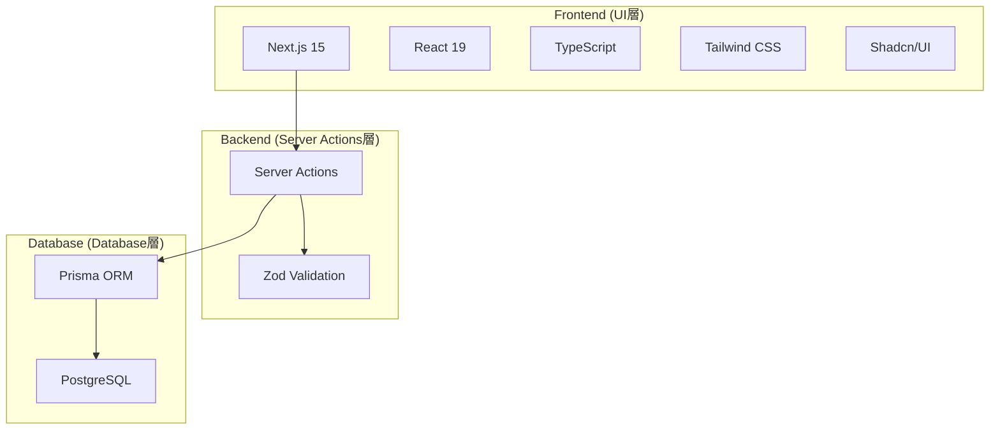

# Biz Clone 設計ドキュメント

## 概要

Biz Clone は、日本の中小企業向けに開発された現代的な会計システムです。  
複式簿記に基づく正確な会計処理と、使いやすいユーザーインターフェースを提供します。

## ドキュメント構成

本設計ドキュメントは、以下の構成でプロジェクトの全体像から具体的な実装詳細まで体系的に説明しています。

### 📋 [01\_プロジェクト概要.md](./01_プロジェクト概要.md)

- **内容**: プロジェクトの概要、技術スタック、主要機能
- **対象読者**: 全ステークホルダー（開発者、PM、経営陣）
- **重要度**: ⭐⭐⭐⭐⭐

プロジェクトの全体像を理解するための出発点です。ビジネス要件と技術選択の背景を説明しています。

### 🏗️ [02\_アーキテクチャ設計.md](./02_アーキテクチャ設計.md)

- **内容**: システム全体のアーキテクチャ、レイヤー構成、設計パターン
- **対象読者**: アーキテクト、リードエンジニア
- **重要度**: ⭐⭐⭐⭐⭐

システムの構造と各コンポーネント間の関係性を理解できます。新しい機能追加時の設計指針としても活用できます。

### 🗄️ [03\_データベース設計.md](./03_データベース設計.md)

- **内容**: ER 図、テーブル仕様、リレーション、インデックス戦略
- **対象読者**: バックエンドエンジニア、DBA
- **重要度**: ⭐⭐⭐⭐⭐

会計システムの核となるデータモデルを詳細に説明。複式簿記の概念をデータベース設計に落とし込んだ構造を理解できます。

### 🎨 [04\_フロントエンド構造.md](./04_フロントエンド構造.md)

- **内容**: UI コンポーネント構成、画面設計、ユーザーフロー
- **対象読者**: フロントエンドエンジニア、UI/UX デザイナー
- **重要度**: ⭐⭐⭐⭐

React/Next.js を使用したモダンなフロントエンド構成と、会計システムに特化した画面設計を説明しています。

### ⚙️ [05\_バックエンド構造.md](./05_バックエンド構造.md)

- **内容**: Service 層、Repository パターン、ビジネスロジック実装
- **対象読者**: バックエンドエンジニア
- **重要度**: ⭐⭐⭐⭐⭐

レイヤードアーキテクチャに基づくバックエンド実装の詳細。会計システム特有のビジネスルールとその実装方法を理解できます。

### 🧪 [06\_開発・テスト環境.md](./06_開発・テスト環境.md)

- **内容**: 開発環境構築、テスト戦略、CI/CD パイプライン
- **対象読者**: 全開発者、DevOps エンジニア
- **重要度**: ⭐⭐⭐⭐

開発効率と品質を担保するためのツール設定とプロセスを説明しています。

### 🚀 [07\_運用・保守.md](./07_運用・保守.md)

- **内容**: デプロイメント、モニタリング、セキュリティ、障害対応
- **対象読者**: DevOps エンジニア、運用チーム
- **重要度**: ⭐⭐⭐⭐

本番環境での安定運用のための戦略と手順を詳細に説明しています。

### 📝 [08\_コーディング規約.md](./08_コーディング規約.md)

- **内容**: TypeScript、React、データベース関連のコーディング規約
- **対象読者**: 全開発者
- **重要度**: ⭐⭐⭐⭐

チーム全体でのコード品質維持のためのガイドライン。新メンバーのオンボーディングにも活用できます。

### 🔧 [09\_型システム統一.md](./09_型システム統一.md)

- **内容**: TypeScript型定義の統一、型安全性の確保、型変換パターン
- **対象読者**: 全開発者
- **重要度**: ⭐⭐⭐⭐⭐

システム全体で使用する型定義の統一方針とベストプラクティス。2025年6月の大型リファクタリングで確立された型システムを説明。

## 技術スタック概要



## 主要機能

### 会計マスタ管理

- **勘定科目管理**: 階層構造対応の勘定科目マスタ
- **補助科目管理**: 勘定科目の詳細分類
- **取引先管理**: 得意先・仕入先等の取引先情報
- **分析コード管理**: 部門・プロジェクト等の管理会計軸

### 仕訳管理

- **仕訳入力**: 複式簿記に基づく正確な仕訳入力
- **仕訳検索**: 条件指定による仕訳の検索・絞り込み
- **仕訳承認**: ワークフロー機能（将来実装予定）

### 帳票出力

- **総勘定元帳**: 勘定科目別の取引履歴
- **試算表**: 貸借対照表・損益計算書の基礎資料
- **補助元帳**: 補助科目別の詳細履歴

## 開発環境クイックスタート

```bash
# 1. リポジトリクローン
git clone <repository-url>
cd biz-clone

# 2. 依存関係インストール
npm install

# 3. 環境変数設定
cp .env.example .env
# .env ファイルを編集

# 4. データベース初期化
npx prisma generate
npx prisma migrate dev

# 5. 開発サーバー起動
npm run dev
```

詳細な環境構築手順は [06\_開発・テスト環境.md](./06_開発・テスト環境.md) を参照してください。

## プロジェクト構造

```
biz-clone/
├── app/                     # Next.js App Router (UI層)
│   ├── actions/            # Server Actions (ビジネスロジック層)
│   │   ├── accounts.ts     # 勘定科目操作
│   │   ├── partners.ts     # 取引先操作
│   │   └── analysis-codes.ts # 分析コード操作
│   ├── master/             # マスタ管理画面
│   │   ├── accounts/       # 勘定科目管理
│   │   ├── partners/       # 取引先管理
│   │   └── analysis-codes/ # 分析コード管理
│   └── siwake/             # 仕訳関連画面
├── components/             # UI コンポーネント (UI層)
│   ├── ui/                 # 基本 UI コンポーネント
│   ├── accounting/         # 会計特化コンポーネント
│   └── layout/             # レイアウトコンポーネント
├── lib/                    # ユーティリティ・データベース層
│   ├── database/           # Prismaクライアント (Database層)
│   ├── schemas/            # Zodバリデーションスキーマ
│   └── utils/              # ユーティリティ関数
├── types/                  # 統一TypeScript型定義
├── prisma/                 # データベーススキーマ・マイグレーション
└── __tests__/              # テストファイル
```

## 開発フロー

1. **要件分析** → [01\_プロジェクト概要.md](./01_プロジェクト概要.md)
2. **設計** → [02\_アーキテクチャ設計.md](./02_アーキテクチャ設計.md), [03\_データベース設計.md](./03_データベース設計.md)
3. **実装** → [04\_フロントエンド構造.md](./04_フロントエンド構造.md), [05\_バックエンド構造.md](./05_バックエンド構造.md)
4. **品質保証** → [06\_開発・テスト環境.md](./06_開発・テスト環境.md), [08\_コーディング規約.md](./08_コーディング規約.md)
5. **運用** → [07\_運用・保守.md](./07_運用・保守.md)

## 貢献ガイド

### 新機能開発

1. [02\_アーキテクチャ設計.md](./02_アーキテクチャ設計.md) の設計原則に従う
2. [08\_コーディング規約.md](./08_コーディング規約.md) のコーディング規約を遵守
3. [06\_開発・テスト環境.md](./06_開発・テスト環境.md) のテスト戦略に基づくテスト作成

### バグ修正

1. [07\_運用・保守.md](./07_運用・保守.md) の障害対応フローに従う
2. 根本原因の調査と再発防止策の検討
3. 必要に応じて設計ドキュメントの更新

### ドキュメント更新

- 実装と乖離が生じた場合は、速やかにドキュメントを更新
- 新しいパターンやベストプラクティスが確立された場合は、規約に反映

## よくある質問

### Q: 新しい勘定科目タイプを追加したい

A: [03\_データベース設計.md](./03_データベース設計.md) の Account テーブル仕様と [05\_バックエンド構造.md](./05_バックエンド構造.md) のバリデーションロジックを参照してください。

### Q: 新しい画面を追加したい

A: [04\_フロントエンド構造.md](./04_フロントエンド構造.md) のページ構成とコンポーネント設計パターンに従って実装してください。

### Q: パフォーマンス問題が発生している

A: [07\_運用・保守.md](./07_運用・保守.md) のモニタリング・パフォーマンス最適化セクションを参照してください。

### Q: テストケースの書き方がわからない

A: [06\_開発・テスト環境.md](./06_開発・テスト環境.md) のテスト戦略と [08\_コーディング規約.md](./08_コーディング規約.md) のテスト規約を参照してください。

## ライセンス

本プロジェクトは [MIT License](../LICENSE) の下で公開されています。

## 更新履歴

| 日付       | バージョン | 内容                     |
| ---------- | ---------- | ------------------------ |
| 2025-06-12 | 1.2.0      | 型システム統一、ユニークチェック機能、ダイアログシステム統一、エラートーストシステム、消費税計算機能の実装 |
| 2025-01-09 | 1.0.0      | 初版設計ドキュメント作成 |

---

📚 **Note**: このドキュメントは living document として、プロジェクトの進行に合わせて継続的に更新されます。最新の情報については、各ドキュメントの更新日時を確認してください。
